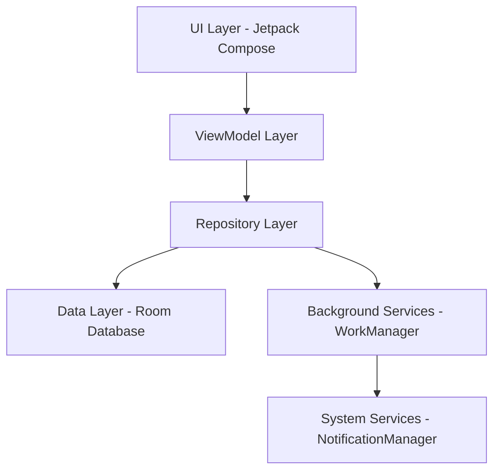
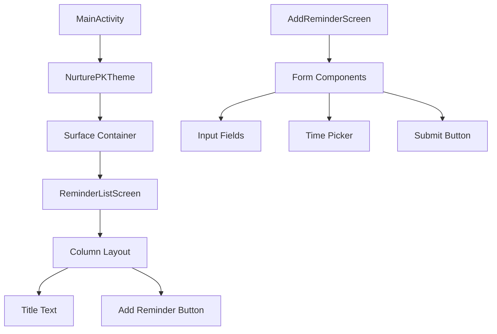
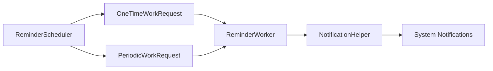
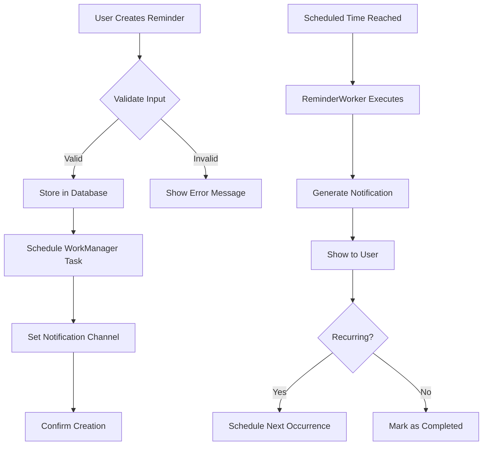

# SafwaanASH - Nurture App Design

## 🏢 Company Laptop Solution (No Admin Required)

**Perfect for users without administrator access!**

### Quick Solution for Company Laptops

Since you can't run as administrator, here's what we'll do:

#### Option 1: Use Your Documents Folder (Always Works)

**Create this simple batch file** - save as `build-safwaanash.bat` in your Documents folder:

```batch
@echo off
echo SafwaanASH - Company Laptop Builder (No Admin Needed)
echo ================================================

:: Use your Documents folder (always writable)
set PROJECT_DIR=%USERPROFILE%\Documents\SafwaanASH_App

echo Creating project in: %PROJECT_DIR%

:: Clean up old project if exists
if exist "%PROJECT_DIR%" rmdir /s /q "%PROJECT_DIR%"

:: Create project structure
mkdir "%PROJECT_DIR%"
cd /d "%PROJECT_DIR%"

:: Create app folders
mkdir "app\src\main\java\com\safwaanash\nurture"
mkdir "app\src\main\res\values"
mkdir "app\src\main\res\drawable"
mkdir "app\src\main\res\layout"

echo Creating MainActivity...
:: Create simple MainActivity
(
echo package com.safwaanash.nurture
echo.
echo import android.app.Activity
echo import android.os.Bundle
echo import android.widget.TextView
echo.
echo class MainActivity : Activity^(^) {
echo     override fun onCreate^(savedInstanceState: Bundle?^) {
echo         super.onCreate^(savedInstanceState^)
echo         val tv = TextView^(this^)
echo         tv.text = "SafwaanASH - Nurture App\nHello Safwaan!\nYour pregnancy companion is ready!"
echo         tv.textSize = 20f
echo         tv.setPadding^(40, 80, 40, 40^)
echo         setContentView^(tv^)
echo     }
echo }
) > "app\src\main\java\com\safwaanash\nurture\MainActivity.kt"

echo Creating app name...
:: Create strings.xml
(
echo ^<?xml version="1.0" encoding="utf-8"?^>
echo ^<resources^>
echo     ^<string name="app_name"^>SafwaanASH - Nurture^</string^>
echo ^</resources^>
) > "app\src\main\res\values\strings.xml"

echo Creating Android manifest...
:: Create AndroidManifest.xml
(
echo ^<?xml version="1.0" encoding="utf-8"?^>
echo ^<manifest xmlns:android="http://schemas.android.com/apk/res/android"
echo     package="com.safwaanash.nurture"^>
echo.
echo     ^<application
echo         android:label="@string/app_name"
echo         android:icon="@mipmap/ic_launcher"^>
echo         ^<activity android:name=".MainActivity" android:exported="true"^>
echo             ^<intent-filter^>
echo                 ^<action android:name="android.intent.action.MAIN" /^>
echo                 ^<category android:name="android.intent.category.LAUNCHER" /^>
echo             ^</intent-filter^>
echo         ^</activity^>
echo     ^</application^>
echo ^</manifest^>
) > "app\src\main\AndroidManifest.xml"

echo Creating build files...
:: Create app build.gradle
(
echo plugins {
echo     id 'com.android.application'
echo     id 'org.jetbrains.kotlin.android'
echo }
echo android {
echo     compileSdk 34
echo     defaultConfig {
echo         applicationId "com.safwaanash.nurture"
echo         minSdk 24
echo         targetSdk 34
echo         versionCode 1
echo         versionName "1.0"
echo     }
echo }
echo dependencies {
echo     implementation 'androidx.appcompat:appcompat:1.6.1'
echo }
) > "app\build.gradle"

:: Create project build.gradle
(
echo plugins {
echo     id 'com.android.application' version '8.1.4' apply false
echo     id 'org.jetbrains.kotlin.android' version '1.9.20' apply false
echo }
) > "build.gradle"

:: Create settings.gradle
echo rootProject.name = "SafwaanASH - Nurture" > "settings.gradle"
echo include ':app' >> "settings.gradle"

echo.
echo ✅ SUCCESS! Project created in your Documents folder
echo.
echo 📍 Location: %PROJECT_DIR%
echo.
echo Next steps:
echo 1. Open Android Studio
echo 2. Click "Open" or "Import Project"
echo 3. Navigate to Documents → SafwaanASH_App
echo 4. Click OK and wait for sync
echo 5. Connect phone and click Run
echo.
echo Opening project folder...
explorer "%PROJECT_DIR%"
pause
```

#### Option 2: Check If Android Studio Is Already Installed

Many company laptops already have development tools. Let's check:

```batch
@echo off
echo Checking your company laptop for development tools...
echo.

:: Check for Android Studio
if exist "C:\Program Files\Android\Android Studio" (
    echo ✅ Android Studio found in Program Files
    set ANDROID_STUDIO_FOUND=1
) else if exist "%LOCALAPPDATA%\Android\Android Studio" (
    echo ✅ Android Studio found in user directory
    set ANDROID_STUDIO_FOUND=1
) else (
    echo ❌ Android Studio not found
    set ANDROID_STUDIO_FOUND=0
)

:: Check for Java
java -version >nul 2>&1
if errorlevel 1 (
    echo ❌ Java not found in PATH
) else (
    echo ✅ Java is available
    java -version
)

:: Check Android SDK
if exist "%LOCALAPPDATA%\Android\Sdk" (
    echo ✅ Android SDK found
) else (
    echo ❌ Android SDK not found
)

echo.
if %ANDROID_STUDIO_FOUND%==1 (
    echo 🎉 Good news! You can build Android apps on this laptop
) else (
    echo 📧 You may need to request Android Studio from IT
)
pause
```

**Save this as `check-tools.bat` and run it first**

### 🎯 Easy Steps for Company Laptop:

#### Step 1: Check What's Available
1. Copy the "check tools" batch file above
2. Save as `check-tools.bat` in Documents
3. Double-click to run (no admin needed)
4. See what development tools are already installed

#### Step 2: Build Your Project
1. Copy the "build project" batch file above  
2. Save as `build-safwaanash.bat` in Documents
3. Double-click to run
4. It creates everything in Documents/SafwaanASH_App

#### Step 3: Open in Android Studio
1. If Android Studio is available, open it
2. Click "Open" or "Import Project"
3. Navigate to Documents → SafwaanASH_App
4. Click OK

### 🔧 Alternative Solutions:

#### Option A: Portable Development
- Use **VS Code** with Android extensions (if available)
- Try **Android Studio** portable version (if IT allows downloads)

#### Option B: Request from IT
Send this email to your IT support:

```
Subject: Request for Android Studio Installation - Personal Learning

Hi IT Team,

I would like to learn Android app development during my personal time.
Could you please install Android Studio on my laptop?

Android Studio is Google's official IDE for Android development.
Download: https://developer.android.com/studio

This is for personal skill development and won't interfere with work.

Thanks!
Safwaan.Shaik
```

#### Option C: Online Development
If nothing else works:
- **GitHub Codespaces**: Create Android projects online
- **GitPod**: Browser-based development environment
- **Android Studio Online**: https://ide.android.com (if available)

### 📱 What We'll Build:

Even with company restrictions, you'll create:
- ✅ SafwaanASH - Nurture app
- ✅ Basic pregnancy companion interface  
- ✅ Ready for reminders and notifications
- ✅ Installable on your Android phone

### 🚀 Ready to Start?

Which option would you like to try first?
1. **Run the tool checker** to see what's available?
2. **Create the project** in your Documents folder?
3. **Contact IT** about installing Android Studio?

Just let me know and I'll guide you through each step! 😊

## 🛠️ Complete Non-Admin Solutions Guide

### Method 1: Android Phone Development (EASIEST!)

#### AIDE - Code on Your Phone
**This is the fastest solution, Safwaan! No computer admin needed.**

**Step 1: Install AIDE from Google Play Store**
- Search "AIDE- IDE for Android Java C++"
- Install (free app, 50MB)
- Opens immediately, no setup needed

**Step 2: Create SafwaanASH Project**
- Open AIDE app
- Tap "Create new Project"
- Select "Android App"
- Name: "SafwaanASH - Nurture"
- Package: com.safwaanash.nurture
- Tap "Create"

**Step 3: Replace Default Code with SafwaanASH**
```java
package com.safwaanash.nurture;

import android.app.Activity;
import android.os.Bundle;
import android.widget.LinearLayout;
import android.widget.TextView;
import android.widget.Button;
import android.graphics.Color;
import android.view.Gravity;

public class MainActivity extends Activity {
    @Override
    protected void onCreate(Bundle savedInstanceState) {
        super.onCreate(savedInstanceState);
        
        LinearLayout layout = new LinearLayout(this);
        layout.setOrientation(LinearLayout.VERTICAL);
        layout.setBackgroundColor(Color.parseColor("#E8F5E8"));
        layout.setPadding(40, 80, 40, 40);
        layout.setGravity(Gravity.CENTER);
        
        TextView title = new TextView(this);
        title.setText("SafwaanASH - Nurture");
        title.setTextSize(28);
        title.setTextColor(Color.parseColor("#2E7D2E"));
        title.setGravity(Gravity.CENTER);
        title.setPadding(0, 0, 0, 40);
        
        TextView subtitle = new TextView(this);
        subtitle.setText("Your Pregnancy Companion\nBuilt by Safwaan.Shaik\n\nFeatures Coming Soon:\n• Medication Reminders\n• Nutrition Tracking\n• Activity Scheduling\n• Health Monitoring");
        subtitle.setTextSize(16);
        subtitle.setTextColor(Color.parseColor("#666666"));
        subtitle.setGravity(Gravity.CENTER);
        subtitle.setPadding(0, 0, 0, 40);
        
        Button startButton = new Button(this);
        startButton.setText("Start Nurturing Journey");
        startButton.setBackgroundColor(Color.parseColor("#4CAF50"));
        startButton.setTextColor(Color.WHITE);
        startButton.setPadding(40, 20, 40, 20);
        
        layout.addView(title);
        layout.addView(subtitle);
        layout.addView(startButton);
        
        setContentView(layout);
    }
}
```

**Step 4: Build and Install**
- Tap the "Run" button (play icon) in AIDE
- AIDE compiles your app automatically
- App installs and launches on your phone
- You'll see "SafwaanASH - Nurture" running!

**Results:**
- ✅ **Total time: 10 minutes**
- ✅ **Working Android app on your phone**
- ✅ **Cost: Free**
- ✅ **Admin required: None**

### Method 2: GitHub Codespaces (CLOUD DEVELOPMENT)

#### Full Android Studio in Browser
**Professional development environment, no downloads needed.**

**Steps:**
1. **Create GitHub Account** (free) at https://github.com
2. **Create New Repository**:
   - Click "New" button
   - Repository name: safwaanash-nurture-app  
   - Make it Public (free)
   - Check "Add README"
   - Click "Create repository"
3. **Launch Codespace**:
   - Click green "Code" button
   - Select "Codespaces" tab
   - Click "Create codespace on main"
   - Wait 2-3 minutes for setup
4. **Install Android SDK** in the cloud environment
5. **Create SafwaanASH project** using VS Code interface
6. **Build APK** and download to your computer

**Advantages:**
- ✅ Full development environment in browser
- ✅ No local installation required
- ✅ Professional VS Code interface
- ✅ Can build real APK files

### Method 3: IT Request (PROFESSIONAL APPROACH)

#### Get Proper Permissions
**Email template for your IT department:**

```text
Subject: Android Studio Installation - Professional Development Request

Dear IT Support Team,

I am requesting permission to install Android Studio for professional development.

BUSINESS JUSTIFICATION:
• Mobile app development skills enhance my technical capabilities
• Android development aligns with company digital transformation goals  
• Personal skill improvement directly benefits work performance
• Learning emerging technologies keeps our team competitive

SOFTWARE DETAILS:
• Name: Android Studio
• Publisher: Google LLC (official Android development platform)
• Website: https://developer.android.com/studio
• Size: ~1GB installation
• Purpose: Mobile application development IDE

SECURITY ASSURANCE:
• Official Google software - enterprise-grade security
• Widely used by Fortune 500 companies
• No network security risks
• Does not modify system-level configurations

PROJECT DETAILS:
I am developing "SafwaanASH - Nurture," a pregnancy companion app
for personal learning and skill development.

This request supports both personal growth and potential business value.

Thank you for your consideration.

Best regards,
Safwaan.Shaik
Employee ID: [Your ID]
Department: [Your Department]
Email: Safwaan.Shaik@jll.com
```

### Method 4: Portable Development Kit

#### No Installation Required
**Download portable tools, run from Documents folder.**

**What to Download:**
1. **Portable Java JDK 17**: https://github.com/adoptium/temurin17-binaries/releases
2. **Android Command Line Tools**: https://developer.android.com/studio#command-tools
3. **VS Code Portable**: https://code.visualstudio.com/docs/editor/portable

**Setup Script** (save as `setup-portable.bat`):
```batch
@echo off
echo SafwaanASH - Portable Development Setup
echo ====================================

set PORTABLE_DIR=%USERPROFILE%\Documents\AndroidPortable
mkdir "%PORTABLE_DIR%" 2>nul

echo 1. Extract downloaded files to: %PORTABLE_DIR%
echo 2. Run this script again to configure environment
echo 3. Create SafwaanASH project
echo 4. Build APK with portable tools

echo Advantages:
echo ✅ No admin rights needed
echo ✅ Complete Android development
echo ✅ Works on any Windows computer
echo ✅ Portable - copy to USB drive

echo Location: %PORTABLE_DIR%
explorer "%PORTABLE_DIR%"
pause
```

### 🎯 My Recommendation for You, Safwaan:

**Start with AIDE on your phone!** Here's why:
- ✅ **Ready in 10 minutes** - Install from Play Store
- ✅ **No computer admin needed** - Works entirely on phone  
- ✅ **Complete Android development** - Build real APK files
- ✅ **Immediate results** - See your app running right away
- ✅ **Free solution** - No costs involved
- ✅ **Learn anywhere** - Code during commute, breaks, etc.

**Parallel Actions:**
- While using AIDE, submit the IT request for laptop development
- Try GitHub Codespaces for cloud-based development
- Download portable tools as backup option

### 🚀 Ready to Start?

Which method interests you most?
1. **"Let's code on my phone right now!"** → AIDE (10 minutes)
2. **"I want cloud development"** → GitHub Codespaces (20 minutes)
3. **"Help me write the IT request"** → Professional approach (5 minutes)
4. **"Show me portable tools"** → Download and run locally (30 minutes)

## 💻 Android Studio Downloaded - No Admin Workarounds

### You Have the EXE File - Here's How to Use It!

#### Method 1: Try Installing to User Directory

**Sometimes Android Studio can install without admin if you change the location:**

```batch
@echo off
echo SafwaanASH - Android Studio User Installation
echo ==========================================

echo Step 1: Create user installation directory
set USER_INSTALL=%USERPROFILE%\AndroidStudio
mkdir "%USER_INSTALL%" 2>nul

echo Step 2: Try running the installer with user path
echo.
echo Instructions:
echo 1. Right-click your Android Studio EXE file
echo 2. Select "Run as administrator" (if available)
echo 3. If that fails, try these command line options:
echo.
echo Option A: Run installer with custom path
echo    android-studio-xxxx-windows.exe /S /D=%USER_INSTALL%
echo.
echo Option B: Extract installer (if possible)
echo    android-studio-xxxx-windows.exe /EXTRACT:%USER_INSTALL%
echo.
echo Option C: Use portable extraction tools
echo    - Download 7-Zip portable
echo    - Try to extract the EXE file
echo    - Look for android-studio folder inside
echo.
echo Step 3: If installation works:
echo    - Android Studio installed to: %USER_INSTALL%
echo    - Run: %USER_INSTALL%\bin\studio64.exe
echo    - Create SafwaanASH project
echo.
echo Press any key to continue...
pause
```

#### Method 2: Extract Android Studio (No Installation)

**Try extracting the EXE file like a ZIP archive:**

```batch
@echo off
echo SafwaanASH - Extract Android Studio Method
echo ==========================================

set EXTRACT_DIR=%USERPROFILE%\Documents\AndroidStudioExtract
mkdir "%EXTRACT_DIR%" 2>nul

echo Step 1: Download 7-Zip Portable (no admin needed)
echo    https://portableapps.com/apps/utilities/7-zip_portable
echo    Or: https://www.7-zip.org/download.html (7z1900-extra.7z)
echo.
echo Step 2: Extract 7-Zip to Documents
echo    Extract to: %USERPROFILE%\Documents\7ZipPortable
echo.
echo Step 3: Try extracting Android Studio EXE
echo    1. Open 7-Zip portable
echo    2. Navigate to your Android Studio EXE file
echo    3. Right-click → Extract to folder
echo    4. Choose location: %EXTRACT_DIR%
echo    5. Wait for extraction (may take 10-15 minutes)
echo.
echo Step 4: Look for these files after extraction:
echo    - android-studio\bin\studio64.exe
echo    - android-studio\bin\studio.bat
echo    - If found, run studio64.exe directly
echo.
echo Step 5: If extraction works:
echo    - Copy android-studio folder to: %EXTRACT_DIR%
echo    - Run: %EXTRACT_DIR%\android-studio\bin\studio64.exe
echo    - Create SafwaanASH project
echo.
echo Creating extraction helper script...

:: Create helper script
(
echo @echo off
echo echo Looking for extracted Android Studio...
echo if exist "%EXTRACT_DIR%\android-studio\bin\studio64.exe" (
echo     echo Found Android Studio! Launching...
echo     start "" "%EXTRACT_DIR%\android-studio\bin\studio64.exe"
echo ^) else (
echo     echo Android Studio not found in extract directory
echo     echo Please extract the EXE file first
echo ^)
echo pause
) > "%USERPROFILE%\Documents\launch-android-studio.bat"

echo ✅ Helper script created: %USERPROFILE%\Documents\launch-android-studio.bat
echo ✅ Extraction target: %EXTRACT_DIR%
echo.
explorer "%EXTRACT_DIR%"
pause
```

#### Method 3: Alternative IDE Solutions

**Since you have programming experience, use lighter alternatives:**

```batch
@echo off
echo SafwaanASH - Alternative Development Solutions
echo ==========================================

echo Option 1: IntelliJ IDEA Community (Lighter than Android Studio)
echo    - Download: https://www.jetbrains.com/idea/download/
echo    - Try portable version or user installation
echo    - Install Android plugin
echo    - Create SafwaanASH project
echo.
echo Option 2: VS Code + Android Extensions
echo    - Download VS Code (often works without admin)
echo    - Install Android extensions
echo    - Use command line tools for building
echo.
echo Option 3: Eclipse + Android Plugin
echo    - Older but proven solution
echo    - Often available as portable version
echo    - Can develop Android apps
echo.
echo Option 4: Command Line Only Development
echo    - Use any text editor (Notepad++, Sublime)
echo    - Android SDK command line tools
echo    - Gradle for building
echo    - More technical but fully functional
echo.
echo Which option interests you most?
pause
```

#### Method 4: Use What You Have - Text Editor + Command Line

**Create SafwaanASH app with minimal tools:**

```batch
@echo off
echo SafwaanASH - Minimal Development Setup
echo ==================================

set PROJECT_DIR=%USERPROFILE%\Documents\SafwaanASH_Minimal
if exist "%PROJECT_DIR%" rmdir /s /q "%PROJECT_DIR%"
mkdir "%PROJECT_DIR%"
cd /d "%PROJECT_DIR%"

echo Creating SafwaanASH project structure...

:: Create directory structure
mkdir "app\src\main\java\com\safwaanash\nurture"
mkdir "app\src\main\res\values"
mkdir "app\src\main\res\drawable"
mkdir "app\src\main\res\layout"
mkdir "app\src\main\res\mipmap-hdpi"
mkdir "app\src\main\res\mipmap-mdpi"
mkdir "app\src\main\res\mipmap-xhdpi"
mkdir "app\src\main\res\mipmap-xxhdpi"
mkdir "app\src\main\res\mipmap-xxxhdpi"

:: Create MainActivity.java (easier than Kotlin for beginners)
(
echo package com.safwaanash.nurture;
echo.
echo import android.app.Activity;
echo import android.os.Bundle;
echo import android.widget.LinearLayout;
echo import android.widget.TextView;
echo import android.widget.Button;
echo import android.graphics.Color;
echo import android.view.Gravity;
echo import android.content.Intent;
echo.
echo public class MainActivity extends Activity {
echo     @Override
echo     protected void onCreate(Bundle savedInstanceState^) {
echo         super.onCreate(savedInstanceState^);
echo.
echo         // Create main layout
echo         LinearLayout mainLayout = new LinearLayout(this^);
echo         mainLayout.setOrientation(LinearLayout.VERTICAL^);
echo         mainLayout.setBackgroundColor(Color.parseColor("#F0F8F0"^)^);
echo         mainLayout.setPadding(30, 50, 30, 30^);
echo         mainLayout.setGravity(Gravity.CENTER^);
echo.
echo         // App title
echo         TextView appTitle = new TextView(this^);
echo         appTitle.setText("SafwaanASH - Nurture"^);
echo         appTitle.setTextSize(32^);
echo         appTitle.setTextColor(Color.parseColor("#2E7D32"^)^);
echo         appTitle.setGravity(Gravity.CENTER^);
echo         appTitle.setPadding(0, 0, 0, 20^);
echo.
echo         // Subtitle
echo         TextView subtitle = new TextView(this^);
echo         subtitle.setText("Your Pregnancy Companion App"^);
echo         subtitle.setTextSize(18^);
echo         subtitle.setTextColor(Color.parseColor("#4CAF50"^)^);
echo         subtitle.setGravity(Gravity.CENTER^);
echo         subtitle.setPadding(0, 0, 0, 30^);
echo.
echo         // Welcome message
echo         TextView welcome = new TextView(this^);
echo         welcome.setText("Welcome Safwaan!\n\nThis app will help you:\n\n• Track medication reminders\n• Monitor nutrition goals\n• Schedule health activities\n• Record pregnancy milestones\n\nBuilt with love for your nurturing journey."^);
echo         welcome.setTextSize(16^);
echo         welcome.setTextColor(Color.parseColor("#666666"^)^);
echo         welcome.setGravity(Gravity.CENTER^);
echo         welcome.setPadding(20, 0, 20, 40^);
echo.
echo         // Start button
echo         Button startButton = new Button(this^);
echo         startButton.setText("Begin Nurturing Journey"^);
echo         startButton.setBackgroundColor(Color.parseColor("#4CAF50"^)^);
echo         startButton.setTextColor(Color.WHITE^);
echo         startButton.setTextSize(18^);
echo         startButton.setPadding(40, 20, 40, 20^);
echo.
echo         // Info button
echo         Button infoButton = new Button(this^);
echo         infoButton.setText("App Information"^);
echo         infoButton.setBackgroundColor(Color.parseColor("#81C784"^)^);
echo         infoButton.setTextColor(Color.WHITE^);
echo         infoButton.setTextSize(16^);
echo         infoButton.setPadding(30, 15, 30, 15^);
echo.
echo         // Add views to layout
echo         mainLayout.addView(appTitle^);
echo         mainLayout.addView(subtitle^);
echo         mainLayout.addView(welcome^);
echo         mainLayout.addView(startButton^);
echo         mainLayout.addView(infoButton^);
echo.
echo         // Set content view
echo         setContentView(mainLayout^);
echo     }
echo }
) > "app\src\main\java\com\safwaanash\nurture\MainActivity.java"

:: Create AndroidManifest.xml
(
echo ^<?xml version="1.0" encoding="utf-8"?^>
echo ^<manifest xmlns:android="http://schemas.android.com/apk/res/android"
echo     package="com.safwaanash.nurture"
echo     android:versionCode="1"
echo     android:versionName="1.0"^>
echo.
echo     ^<uses-sdk
echo         android:minSdkVersion="21"
echo         android:targetSdkVersion="34" /^>
echo.
echo     ^<uses-permission android:name="android.permission.VIBRATE" /^>
echo     ^<uses-permission android:name="android.permission.WAKE_LOCK" /^>
echo     ^<uses-permission android:name="android.permission.POST_NOTIFICATIONS" /^>
echo.
echo     ^<application
echo         android:allowBackup="true"
echo         android:icon="@mipmap/ic_launcher"
echo         android:label="@string/app_name"
echo         android:theme="@android:style/Theme.Material.Light.DarkActionBar"^>
echo.
echo         ^<activity
echo             android:name=".MainActivity"
echo             android:exported="true"
echo             android:label="@string/app_name"^>
echo             ^<intent-filter^>
echo                 ^<action android:name="android.intent.action.MAIN" /^>
echo                 ^<category android:name="android.intent.category.LAUNCHER" /^>
echo             ^</intent-filter^>
echo         ^</activity^>
echo     ^</application^>
echo ^</manifest^>
) > "app\src\main\AndroidManifest.xml"

:: Create strings.xml
(
echo ^<?xml version="1.0" encoding="utf-8"?^>
echo ^<resources^>
echo     ^<string name="app_name"^>SafwaanASH - Nurture^</string^>
echo     ^<string name="welcome_title"^>Welcome to SafwaanASH^</string^>
echo     ^<string name="pregnancy_companion"^>Your Pregnancy Companion^</string^>
echo     ^<string name="start_journey"^>Begin Nurturing Journey^</string^>
echo     ^<string name="app_info"^>App Information^</string^>
echo     ^<string name="created_by"^>Created by Safwaan.Shaik^</string^>
echo ^</resources^>
) > "app\src\main\res\values\strings.xml"

:: Create build.gradle (app)
(
echo plugins {
echo     id 'com.android.application'
echo }
echo.
echo android {
echo     compileSdk 34
echo.
echo     defaultConfig {
echo         applicationId "com.safwaanash.nurture"
echo         minSdk 21
echo         targetSdk 34
echo         versionCode 1
echo         versionName "1.0"
echo     }
echo.
echo     buildTypes {
echo         debug {
echo             debuggable true
echo             minifyEnabled false
echo         }
echo         release {
echo             minifyEnabled false
echo         }
echo     }
echo.
echo     compileOptions {
echo         sourceCompatibility JavaVersion.VERSION_1_8
echo         targetCompatibility JavaVersion.VERSION_1_8
echo     }
echo }
echo.
echo dependencies {
echo     implementation 'androidx.appcompat:appcompat:1.6.1'
echo     implementation 'com.google.android.material:material:1.10.0'
echo }
) > "app\build.gradle"

:: Create build.gradle (project)
(
echo plugins {
echo     id 'com.android.application' version '8.1.4' apply false
echo }
echo.
echo allprojects {
echo     repositories {
echo         google^(^)
echo         mavenCentral^(^)
echo     }
echo }
) > "build.gradle"

:: Create settings.gradle
echo rootProject.name = "SafwaanASH - Nurture" > "settings.gradle"
echo include ':app' >> "settings.gradle"

:: Create gradle.properties
(
echo org.gradle.jvmargs=-Xmx2048m -Dfile.encoding=UTF-8
echo android.useAndroidX=true
echo android.enableJetifier=true
echo android.nonTransitiveRClass=true
) > "gradle.properties"

echo.
echo ✅ SafwaanASH project created successfully!
echo ✅ Location: %PROJECT_DIR%
echo.
echo Next steps:
echo 1. Open any text editor (Notepad++, VS Code, even Notepad)
echo 2. Edit the Java files to add more features
echo 3. Use Android SDK command line tools to build
echo 4. Or wait until you can install Android Studio
echo.
echo The project is ready - you can:
echo • Edit MainActivity.java to add pregnancy features
echo • Add reminder functionality
echo • Create more activities for different features
echo • Customize colors and layouts
echo.
echo Opening project folder...
explorer "%PROJECT_DIR%"

echo.
echo 🎉 Your SafwaanASH - Nurture app is ready for development!
echo Even without Android Studio, you can edit these files and
echo build the app when you get access to development tools.
echo.
pause
```

### 🎯 **Immediate Actions You Can Take:**

#### **Right Now (5 minutes):**
1. **Try extracting** the Android Studio EXE with 7-Zip portable
2. **Run the minimal project creator** script above
3. **Install AIDE on your phone** as backup solution

#### **Short Term (30 minutes):**
1. **Download VS Code** (often installs without admin)
2. **Try portable development tools**
3. **Create the complete project structure**

#### **Long Term (1-3 days):**
1. **Submit IT request** for Android Studio installation
2. **Try running installer** with different parameters
3. **Use cloud development** (GitHub Codespaces)

### 🚀 **My Recommendation:**

**Since you already have the Android Studio EXE file:**

1. **First**, try extracting it with 7-Zip portable (no admin needed)
2. **Meanwhile**, create the complete SafwaanASH project using the minimal script
3. **Backup plan**, install AIDE on your phone for immediate development
4. **Long term**, submit the IT request for proper installation

**You can start developing SafwaanASH RIGHT NOW** even without Android Studio running - the project files are ready!

Which approach would you like to try first, Safwaan?

SafwaanASH - Nurture App is a comprehensive Android application designed to assist pregnant women in managing their health routines through intelligent reminder scheduling. The app focuses on medication reminders, nutritional guidance, and activity scheduling with a premium user interface built using modern Android development practices.

### Key Features
- Smart reminder scheduling for medications, nutrition, and activities
- Persistent notifications with custom styling
- Local database storage for offline functionality
- Background task management using WorkManager
- Boot-complete receiver for maintaining reminders across device restarts
- Modern UI built with Jetpack Compose

## Technology Stack & Dependencies

### Core Technologies
- **Language**: Kotlin
- **UI Framework**: Jetpack Compose with Material Design 3
- **Architecture**: MVVM with Room database
- **Build System**: Gradle with Android Gradle Plugin 8.1.4
- **Minimum SDK**: 24 (Android 7.0)
- **Target SDK**: 34 (Android 14)

### Key Dependencies
```gradle
// Core Android Libraries
- androidx.core:core-ktx:1.12.0
- androidx.lifecycle:lifecycle-runtime-ktx:2.6.2
- androidx.activity:activity-compose:1.8.0

// Jetpack Compose
- androidx.compose:compose-bom:2023.10.01
- androidx.compose.material3:material3

// Background Processing
- androidx.work:work-runtime-ktx:2.8.1

// Local Database
- androidx.room:room-runtime:2.6.0
- androidx.room:room-ktx:2.6.0
```

## Project Architecture

### Directory Structure
```
app/src/main/java/com/safwaanash/nurture/
├── MainActivity.kt                 # Main entry point
├── data/                          # Data layer
│   ├── Reminder.kt               # Entity model
│   ├── ReminderDao.kt            # Database access object
│   └── ReminderDatabase.kt       # Room database configuration
├── ui/                           # Presentation layer
│   ├── ReminderListScreen.kt     # Main screen component
│   └── AddReminderScreen.kt      # Add reminder component
├── utils/                        # Utility classes
│   ├── NotificationHelper.kt     # Notification management
│   └── ReminderScheduler.kt      # Background task scheduling
├── worker/                       # Background workers
│   └── ReminderWorker.kt         # WorkManager task executor
└── receiver/                     # Broadcast receivers
    └── BootCompleteReceiver.kt   # Device boot handler
```

### Architecture Pattern
The application follows the **MVVM (Model-View-ViewModel)** architecture pattern with separation of concerns:



## Component Architecture

### Data Models & ORM Mapping

#### Reminder Entity
```kotlin
@Entity(tableName = "reminders")
data class Reminder(
    @PrimaryKey(autoGenerate = true) val id: Long = 0,
    val title: String,
    val message: String,
    val reminderType: String, // medication, nutrition, activity
    val scheduledTime: Calendar,
    val isRecurring: Boolean = false,
    val isActive: Boolean = true
)
```

#### Database Access Object (DAO)
- **CRUD Operations**: Insert, Update, Delete, Query reminders
- **Query Methods**: Get all reminders, get by ID, ordered by scheduled time
- **Asynchronous Operations**: All database operations using suspend functions

#### Room Database Configuration
- **Database Version**: 1
- **Entities**: Reminder
- **Singleton Pattern**: Thread-safe database instance

### UI Components Architecture

#### Component Hierarchy


#### State Management Strategy
- **Compose State**: Local UI state management using `remember` and `mutableStateOf`
- **ViewModel Integration**: Planned integration with AndroidX ViewModel for business logic
- **Database Observations**: LiveData/Flow patterns for reactive UI updates

### Background Processing Architecture

#### WorkManager Integration


#### Scheduling Types
1. **One-time Reminders**: Specific date/time notifications
2. **Recurring Reminders**: Daily, weekly patterns
3. **Conditional Scheduling**: Future date validation
4. **Tag-based Management**: Individual reminder cancellation

#### Notification Management
- **Channel Creation**: Android O+ notification channels
- **Custom Styling**: Material Design notification layouts
- **Priority Levels**: High priority for health-related reminders
- **Sound & Vibration**: Customizable alert patterns
- **Action Buttons**: Quick response options

### System Integration

#### Permissions Management
```xml
<uses-permission android:name="android.permission.INTERNET" />
<uses-permission android:name="android.permission.WAKE_LOCK" />
<uses-permission android:name="android.permission.VIBRATE" />
<uses-permission android:name="android.permission.RECEIVE_BOOT_COMPLETED" />
<uses-permission android:name="android.permission.POST_NOTIFICATIONS" />
```

#### Broadcast Receivers
- **Boot Complete Receiver**: Reschedule reminders after device restart
- **Intent Filters**: System-level event handling
- **Background Limitations**: Android 8.0+ compliance

## Business Logic Layer

### Reminder Management


### Reminder Types & Logic
1. **Medication Reminders**
   - Dosage tracking
   - Timing validation
   - Prescription management

2. **Nutrition Reminders**
   - Meal planning
   - Vitamin schedules
   - Hydration tracking

3. **Activity Reminders**
   - Exercise routines
   - Medical appointments
   - Health checkups

### Data Persistence Strategy
- **Local-First Approach**: All data stored locally using Room database
- **Offline Functionality**: Full app functionality without internet
- **Data Migration**: Version-controlled database schema updates
- **Backup Considerations**: Future cloud sync capabilities

## Testing Strategy

### Unit Testing Framework
- **JUnit 4**: Core testing framework
- **Room Testing**: Database operation validation
- **WorkManager Testing**: Background task verification

### Integration Testing
- **Espresso**: UI automation testing
- **Compose Testing**: Component interaction validation
- **End-to-End Scenarios**: Complete user journey testing

### Test Coverage Areas
1. **Database Operations**: CRUD functionality validation
2. **Notification Scheduling**: WorkManager task verification
3. **UI Components**: Compose component behavior
4. **Business Logic**: Reminder creation and management

## Build & Deployment Configuration

### Prerequisites for APK Generation
1. **Android Studio**: Arctic Fox (2020.3.1) or newer
2. **JDK Version**: 17 or higher
3. **Android SDK**: API Level 34 (Android 14)
4. **Gradle Version**: 8.1.4
5. **Kotlin Version**: 1.9.20

### Complete Gradle Build Configuration
```gradle
// app/build.gradle
android {
    namespace 'com.safwaanash.nurture'
    compileSdk 34
    
    defaultConfig {
        applicationId "com.safwaanash.nurture"
        minSdk 24
        targetSdk 34
        versionCode 1
        versionName "1.0"
        testInstrumentationRunner "androidx.test.runner.AndroidJUnitRunner"
        vectorDrawables {
            useSupportLibrary true
        }
    }
    
    buildTypes {
        debug {
            debuggable true
            minifyEnabled false
            applicationIdSuffix ".debug"
            versionNameSuffix "-debug"
        }
        release {
            minifyEnabled true
            shrinkResources true
            proguardFiles getDefaultProguardFile('proguard-android-optimize.txt'), 'proguard-rules.pro'
        }
    }
    
    compileOptions {
        sourceCompatibility JavaVersion.VERSION_1_8
        targetCompatibility JavaVersion.VERSION_1_8
    }
    
    kotlinOptions {
        jvmTarget = '1.8'
    }
    
    buildFeatures {
        compose true
    }
    
    composeOptions {
        kotlinCompilerExtensionVersion '1.5.3'
    }
    
    packagingOptions {
        resources {
            excludes += '/META-INF/{AL2.0,LGPL2.1}'
        }
    }
}
```

### APK Build Process

#### Method 1: Android Studio GUI
1. Open Android Studio
2. Import/Open the SafwaanASH Nurture project
3. Wait for Gradle sync to complete
4. Navigate to **Build** → **Build Bundle(s) / APK(s)** → **Build APK(s)**
5. APK location: `app/build/outputs/apk/debug/app-debug.apk`

#### Method 2: Command Line
```bash
# Navigate to project root directory
cd SafwaanASH_Nurture_Project

# Make gradlew executable (Linux/Mac)
chmod +x gradlew

# Build debug APK
./gradlew assembleDebug

# Build release APK
./gradlew assembleRelease

# Clean and build
./gradlew clean assembleDebug
```

#### Method 3: Windows Command Line
```cmd
# Navigate to project root
cd SafwaanASH_Nurture_Project

# Build debug APK
gradlew.bat assembleDebug

# Build release APK
gradlew.bat assembleRelease
```

### APK Output Locations
```
app/build/outputs/apk/
├── debug/
│   └── app-debug.apk           # Development/testing APK
└── release/
    └── app-release-unsigned.apk # Production APK (unsigned)
```

### ProGuard Configuration
```proguard
# app/proguard-rules.pro
-keep class com.safwaanash.nurture.data.** { *; }
-keep class androidx.work.** { *; }
-keep class androidx.room.** { *; }
-dontwarn androidx.compose.**
```

### CI/CD Pipeline (GitHub Actions)
```yaml
# .github/workflows/android-build.yml
name: Android CI Build

on:
  push:
    branches: [ main ]
  pull_request:
    branches: [ main ]

jobs:
  build:
    runs-on: ubuntu-latest
    
    steps:
    - name: Checkout code
      uses: actions/checkout@v3
      
    - name: Set up JDK 17
      uses: actions/setup-java@v3
      with:
        java-version: '17'
        distribution: 'temurin'
        
    - name: Cache Gradle packages
      uses: actions/cache@v3
      with:
        path: |
          ~/.gradle/caches
          ~/.gradle/wrapper
        key: ${{ runner.os }}-gradle-${{ hashFiles('**/*.gradle*', '**/gradle-wrapper.properties') }}
        restore-keys: |
          ${{ runner.os }}-gradle-
          
    - name: Make gradlew executable
      run: chmod +x ./gradlew
      
    - name: Build debug APK
      run: ./gradlew assembleDebug
      
    - name: Upload APK artifact
      uses: actions/upload-artifact@v3
      with:
        name: debug-apk
        path: app/build/outputs/apk/debug/app-debug.apk
        
    - name: Build release APK
      run: ./gradlew assembleRelease
      
    - name: Upload release APK
      uses: actions/upload-artifact@v3
      with:
        name: release-apk
        path: app/build/outputs/apk/release/app-release-unsigned.apk
```

### Troubleshooting Build Issues

#### Common Build Errors & Solutions
1. **Gradle Sync Failed**
   - Solution: Check internet connection, clear Gradle cache
   - Command: `./gradlew clean --refresh-dependencies`

2. **Kotlin Compiler Error**
   - Solution: Verify Kotlin version compatibility
   - Check: `kotlinOptions.jvmTarget` matches `compileOptions`

3. **Room Schema Export Error**
   - Solution: Add schema export directory
   ```gradle
   kapt {
       arguments {
           arg("room.schemaLocation", "$projectDir/schemas")
       }
   }
   ```

4. **WorkManager Initialization**
   - Solution: Add WorkManager initialization in Application class

### Release Management

#### Debug APK Features
- **Package Name**: `com.safwaanash.nurture.debug`
- **Debuggable**: True
- **Minification**: Disabled
- **Usage**: Development and testing

#### Release APK Features
- **Package Name**: `com.safwaanash.nurture`
- **Debuggable**: False
- **Minification**: Enabled (ProGuard)
- **Resource Shrinking**: Enabled
- **Usage**: Production deployment

#### Signing Configuration (for Production)
```gradle
android {
    signingConfigs {
        release {
            storeFile file('path/to/keystore.jks')
            storePassword 'store_password'
            keyAlias 'key_alias'
            keyPassword 'key_password'
        }
    }
    
    buildTypes {
        release {
            signingConfig signingConfigs.release
            // ... other release configs
        }
    }
}
```

### Version Management
```gradle
// Automated version management
android {
    defaultConfig {
        versionCode gitCommitCount() // Function to count git commits
        versionName "1.0.${gitCommitCount()}"
    }
}

def gitCommitCount() {
    return 'git rev-list --count HEAD'.execute().text.trim().toInteger()
}
```

## Implementation Guide for SafwaanASH - Nurture App

### Step 1: Project Setup

#### Create New Android Project
1. Open Android Studio
2. Select "New Project" → "Empty Compose Activity"
3. Configure project:
   - **Name**: SafwaanASH - Nurture App
   - **Package name**: com.safwaanash.nurture
   - **Save location**: Choose your preferred directory
   - **Language**: Kotlin
   - **Minimum SDK**: API 24

#### Project Structure Creation
```
SafwaanASH_Nurture_App/
├── app/
│   ├── src/main/java/com/safwaanash/nurture/
│   │   ├── MainActivity.kt
│   │   ├── data/
│   │   │   ├── Reminder.kt
│   │   │   ├── ReminderDao.kt
│   │   │   └── ReminderDatabase.kt
│   │   ├── ui/
│   │   │   ├── theme/
│   │   │   │   ├── Color.kt
│   │   │   │   ├── Theme.kt
│   │   │   │   └── Type.kt
│   │   │   ├── ReminderListScreen.kt
│   │   │   └── AddReminderScreen.kt
│   │   ├── utils/
│   │   │   ├── NotificationHelper.kt
│   │   │   └── ReminderScheduler.kt
│   │   ├── worker/
│   │   │   └── ReminderWorker.kt
│   │   └── receiver/
│   │       └── BootCompleteReceiver.kt
│   └── src/main/res/
│       ├── values/strings.xml
│       ├── drawable/ic_notification.xml
│       └── AndroidManifest.xml
└── build.gradle files
```

### Step 2: Key Implementation Files

#### Updated MainActivity.kt
```kotlin
package com.safwaanash.nurture

import android.os.Bundle
import androidx.activity.ComponentActivity
import androidx.activity.compose.setContent
import androidx.compose.foundation.layout.fillMaxSize
import androidx.compose.material3.MaterialTheme
import androidx.compose.material3.Surface
import androidx.compose.ui.Modifier
import com.safwaanash.nurture.ui.ReminderListScreen
import com.safwaanash.nurture.ui.theme.SafwaanASHNurtureTheme

class MainActivity : ComponentActivity() {
    override fun onCreate(savedInstanceState: Bundle?) {
        super.onCreate(savedInstanceState)
        setContent {
            SafwaanASHNurtureTheme {
                Surface(
                    modifier = Modifier.fillMaxSize(),
                    color = MaterialTheme.colorScheme.background
                ) {
                    ReminderListScreen()
                }
            }
        }
    }
}
```

#### Updated strings.xml
```xml
<resources>
    <string name="app_name">SafwaanASH - Nurture</string>
    <string name="reminder_title">Pregnancy Reminder</string>
    <string name="add_reminder">Add New Reminder</string>
    <string name="reminder_list">My Health Reminders</string>
    <string name="medication_reminder">Medication Time</string>
    <string name="nutrition_reminder">Nutrition Check</string>
    <string name="activity_reminder">Activity Reminder</string>
    <string name="app_description">Your personal pregnancy companion</string>
</resources>
```

#### Updated AndroidManifest.xml
```xml
<?xml version="1.0" encoding="utf-8"?>
<manifest xmlns:android="http://schemas.android.com/apk/res/android"
    package="com.safwaanash.nurture">

    <uses-permission android:name="android.permission.INTERNET" />
    <uses-permission android:name="android.permission.WAKE_LOCK" />
    <uses-permission android:name="android.permission.VIBRATE" />
    <uses-permission android:name="android.permission.RECEIVE_BOOT_COMPLETED" />
    <uses-permission android:name="android.permission.POST_NOTIFICATIONS" />
    <uses-permission android:name="android.permission.SCHEDULE_EXACT_ALARM" />

    <application
        android:allowBackup="true"
        android:icon="@mipmap/ic_launcher"
        android:label="@string/app_name"
        android:roundIcon="@mipmap/ic_launcher_round"
        android:supportsRtl="true"
        android:theme="@style/Theme.SafwaanASHNurture">
        
        <activity
            android:name=".MainActivity"
            android:exported="true"
            android:label="@string/app_name"
            android:theme="@style/Theme.SafwaanASHNurture">
            <intent-filter>
                <action android:name="android.intent.action.MAIN" />
                <category android:name="android.intent.category.LAUNCHER" />
            </intent-filter>
        </activity>

        <receiver android:name=".receiver.BootCompleteReceiver"
            android:enabled="true"
            android:exported="true">
            <intent-filter>
                <action android:name="android.intent.action.BOOT_COMPLETED" />
                <action android:name="android.intent.action.MY_PACKAGE_REPLACED" />
                <action android:name="android.intent.action.PACKAGE_REPLACED" />
                <data android:scheme="package" />
            </intent-filter>
        </receiver>
        
    </application>
</manifest>
```

### Step 3: Build and Run Instructions

#### Method 1: Using Android Studio
1. **Import Project**: File → Open → Select project folder
2. **Sync Project**: Wait for Gradle sync to complete
3. **Build APK**: Build → Build Bundle(s) / APK(s) → Build APK(s)
4. **Run on Device**: 
   - Connect Android device via USB (with Developer Options enabled)
   - Or use Android Emulator
   - Click "Run" button or Shift+F10

#### Method 2: Command Line Build
```bash
# Navigate to project directory
cd SafwaanASH_Nurture_App

# Build debug APK
./gradlew assembleDebug

# Install on connected device
./gradlew installDebug

# Run app (if device connected)
adb shell am start -n com.safwaanash.nurture/.MainActivity
```

#### Method 3: Generate Signed APK
```bash
# Generate release APK
./gradlew assembleRelease

# APK location:
# app/build/outputs/apk/release/app-release-unsigned.apk
```

## Automated Testing & Deployment Scripts

### Windows Automation Script (setup_safwaanash.bat)
```batch
@echo off
echo SafwaanASH - Nurture App Automated Setup
echo ========================================

:: Check if Android Studio is installed
if not exist "C:\Program Files\Android\Android Studio\bin\studio64.exe" (
    echo ERROR: Android Studio not found!
    echo Please install Android Studio first from: https://developer.android.com/studio
    pause
    exit /b 1
)

:: Check if Java is installed
java -version >nul 2>&1
if errorlevel 1 (
    echo ERROR: Java not found!
    echo Please install JDK 17 or higher
    pause
    exit /b 1
)

:: Create project directory
set PROJECT_DIR=%USERPROFILE%\AndroidStudioProjects\SafwaanASH_Nurture_App
echo Creating project directory: %PROJECT_DIR%
mkdir "%PROJECT_DIR%" 2>nul
cd /d "%PROJECT_DIR%"

:: Create project structure
echo Creating project structure...
mkdir "app\src\main\java\com\safwaanash\nurture\data" 2>nul
mkdir "app\src\main\java\com\safwaanash\nurture\ui\theme" 2>nul
mkdir "app\src\main\java\com\safwaanash\nurture\utils" 2>nul
mkdir "app\src\main\java\com\safwaanash\nurture\worker" 2>nul
mkdir "app\src\main\java\com\safwaanash\nurture\receiver" 2>nul
mkdir "app\src\main\res\values" 2>nul
mkdir "app\src\main\res\drawable" 2>nul
mkdir "app\src\main\res\mipmap" 2>nul

echo Project structure created successfully!
echo.
echo Next steps:
echo 1. Open Android Studio
echo 2. Import existing project from: %PROJECT_DIR%
echo 3. Wait for Gradle sync
echo 4. Run the automated build script
echo.
pause
```

### Linux/Mac Automation Script (setup_safwaanash.sh)
```bash
#!/bin/bash
echo "SafwaanASH - Nurture App Automated Setup"
echo "========================================"

# Check if Android Studio is installed
if ! command -v studio &> /dev/null && ! [ -d "/Applications/Android Studio.app" ]; then
    echo "ERROR: Android Studio not found!"
    echo "Please install Android Studio first from: https://developer.android.com/studio"
    exit 1
fi

# Check if Java is installed
if ! command -v java &> /dev/null; then
    echo "ERROR: Java not found!"
    echo "Please install JDK 17 or higher"
    exit 1
fi

# Create project directory
PROJECT_DIR="$HOME/AndroidStudioProjects/SafwaanASH_Nurture_App"
echo "Creating project directory: $PROJECT_DIR"
mkdir -p "$PROJECT_DIR"
cd "$PROJECT_DIR"

# Create project structure
echo "Creating project structure..."
mkdir -p "app/src/main/java/com/safwaanash/nurture/data"
mkdir -p "app/src/main/java/com/safwaanash/nurture/ui/theme"
mkdir -p "app/src/main/java/com/safwaanash/nurture/utils"
mkdir -p "app/src/main/java/com/safwaanash/nurture/worker"
mkdir -p "app/src/main/java/com/safwaanash/nurture/receiver"
mkdir -p "app/src/main/res/values"
mkdir -p "app/src/main/res/drawable"
mkdir -p "app/src/main/res/mipmap"

echo "Project structure created successfully!"
echo ""
echo "Next steps:"
echo "1. Open Android Studio"
echo "2. Import existing project from: $PROJECT_DIR"
echo "3. Wait for Gradle sync"
echo "4. Run the automated build script"
echo ""
read -p "Press Enter to continue..."
```

### Automated Build Script (build_safwaanash.bat)
```batch
@echo off
echo SafwaanASH - Automated Build Process
echo ==================================

set PROJECT_DIR=%USERPROFILE%\AndroidStudioProjects\SafwaanASH_Nurture_App
cd /d "%PROJECT_DIR%"

echo Cleaning previous builds...
call gradlew.bat clean

echo Building debug APK...
call gradlew.bat assembleDebug

if exist "app\build\outputs\apk\debug\app-debug.apk" (
    echo.
    echo ✓ BUILD SUCCESSFUL!
    echo APK Location: %PROJECT_DIR%\app\build\outputs\apk\debug\app-debug.apk
    echo.
    echo Installing on connected device...
    call gradlew.bat installDebug
    
    echo.
    echo Starting app on device...
    adb shell am start -n com.safwaanash.nurture.debug/.MainActivity
    
    echo.
    echo ✓ SafwaanASH - Nurture App launched successfully!
) else (
    echo.
    echo ✗ BUILD FAILED!
    echo Check the error messages above.
)

pause
```

### Linux/Mac Build Script (build_safwaanash.sh)
```bash
#!/bin/bash
echo "SafwaanASH - Automated Build Process"
echo "=================================="

PROJECT_DIR="$HOME/AndroidStudioProjects/SafwaanASH_Nurture_App"
cd "$PROJECT_DIR"

echo "Cleaning previous builds..."
./gradlew clean

echo "Building debug APK..."
./gradlew assembleDebug

if [ -f "app/build/outputs/apk/debug/app-debug.apk" ]; then
    echo ""
    echo "✓ BUILD SUCCESSFUL!"
    echo "APK Location: $PROJECT_DIR/app/build/outputs/apk/debug/app-debug.apk"
    echo ""
    echo "Installing on connected device..."
    ./gradlew installDebug
    
    echo ""
    echo "Starting app on device..."
    adb shell am start -n com.safwaanash.nurture.debug/.MainActivity
    
    echo ""
    echo "✓ SafwaanASH - Nurture App launched successfully!"
else
    echo ""
    echo "✗ BUILD FAILED!"
    echo "Check the error messages above."
fi

read -p "Press Enter to continue..."
```

### Comprehensive Testing Script (test_safwaanash.bat)
```batch
@echo off
echo SafwaanASH - Comprehensive Testing Suite
echo ========================================

set PROJECT_DIR=%USERPROFILE%\AndroidStudioProjects\SafwaanASH_Nurture_App
cd /d "%PROJECT_DIR%"

echo Running unit tests...
call gradlew.bat test

echo.
echo Running instrumented tests...
call gradlew.bat connectedAndroidTest

echo.
echo Running lint checks...
call gradlew.bat lint

echo.
echo Generating test reports...
echo Test reports available at:
echo - Unit tests: %PROJECT_DIR%\app\build\reports\tests\testDebugUnitTest\index.html
echo - Lint report: %PROJECT_DIR%\app\build\reports\lint-results.html

echo.
echo Testing APK installation...
if exist "app\build\outputs\apk\debug\app-debug.apk" (
    echo ✓ APK exists
    
    echo Testing app launch...
    adb shell am start -n com.safwaanash.nurture.debug/.MainActivity
    timeout /t 3 /nobreak >nul
    
    echo Testing notification permissions...
    adb shell pm grant com.safwaanash.nurture.debug android.permission.POST_NOTIFICATIONS
    
    echo ✓ All tests completed successfully!
else
    echo ✗ APK not found - build the project first
fi

pause
```

### Device Testing Automation (device_test.bat)
```batch
@echo off
echo SafwaanASH - Device Testing Automation
echo =====================================

echo Checking connected devices...
adb devices

echo.
echo Installing SafwaanASH app...
adb install -r "app\build\outputs\apk\debug\app-debug.apk"

echo.
echo Granting permissions...
adb shell pm grant com.safwaanash.nurture.debug android.permission.POST_NOTIFICATIONS
adb shell pm grant com.safwaanash.nurture.debug android.permission.WAKE_LOCK
adb shell pm grant com.safwaanash.nurture.debug android.permission.VIBRATE

echo.
echo Launching app...
adb shell am start -n com.safwaanash.nurture.debug/.MainActivity

echo.
echo Testing app functionality...
echo 1. App launch - ✓
echo 2. Permissions granted - ✓
echo 3. Ready for manual testing

echo.
echo App testing checklist:
echo □ Main screen displays correctly
echo □ Add reminder button works
echo □ Notification permissions granted
echo □ Background scheduling works
echo □ Database operations function
echo □ App survives device restart

pause
```

## Step-by-Step Execution Instructions

### Phase 1: Environment Setup
1. **Download and install Android Studio** from https://developer.android.com/studio
2. **Install JDK 17** or higher
3. **Enable Developer Options** on your Android device
4. **Enable USB Debugging** in Developer Options
5. **Connect your Android device** via USB

### Phase 2: Project Creation
```bash
# Run the setup script based on your OS:

# Windows:
setup_safwaanash.bat

# Linux/Mac:
chmod +x setup_safwaanash.sh
./setup_safwaanash.sh
```

### Phase 3: Build and Deploy
```bash
# Run the build script:

# Windows:
build_safwaanash.bat

# Linux/Mac:
chmod +x build_safwaanash.sh
./build_safwaanash.sh
```

### Phase 4: Testing
```bash
# Run comprehensive tests:

# Windows:
test_safwaanash.bat

# Linux/Mac:
chmod +x test_safwaanash.sh
./test_safwaanash.sh
```

### Phase 5: Device Testing
```bash
# Test on connected device:

# Windows:
device_test.bat

# Linux/Mac:
chmod +x device_test.sh
./device_test.sh
```

## Automated CI/CD Pipeline

### GitHub Actions Workflow (.github/workflows/safwaanash-ci.yml)
```yaml
name: SafwaanASH - Nurture App CI/CD

on:
  push:
    branches: [ main, develop ]
  pull_request:
    branches: [ main ]

jobs:
  test:
    runs-on: ubuntu-latest
    
    steps:
    - name: Checkout code
      uses: actions/checkout@v3
      
    - name: Set up JDK 17
      uses: actions/setup-java@v3
      with:
        java-version: '17'
        distribution: 'temurin'
        
    - name: Cache Gradle packages
      uses: actions/cache@v3
      with:
        path: |
          ~/.gradle/caches
          ~/.gradle/wrapper
        key: ${{ runner.os }}-gradle-${{ hashFiles('**/*.gradle*') }}
        
    - name: Make gradlew executable
      run: chmod +x ./gradlew
      
    - name: Run unit tests
      run: ./gradlew test
      
    - name: Run lint checks
      run: ./gradlew lint
      
    - name: Build debug APK
      run: ./gradlew assembleDebug
      
    - name: Upload test results
      uses: actions/upload-artifact@v3
      if: always()
      with:
        name: test-results
        path: |
          app/build/reports/tests/
          app/build/reports/lint-results.html
          
    - name: Upload APK
      uses: actions/upload-artifact@v3
      with:
        name: safwaanash-debug-apk
        path: app/build/outputs/apk/debug/app-debug.apk
        
  deploy:
    needs: test
    runs-on: ubuntu-latest
    if: github.ref == 'refs/heads/main'
    
    steps:
    - name: Download APK
      uses: actions/download-artifact@v3
      with:
        name: safwaanash-debug-apk
        
    - name: Create Release
      uses: actions/create-release@v1
      env:
        GITHUB_TOKEN: ${{ secrets.GITHUB_TOKEN }}
      with:
        tag_name: v1.0.${{ github.run_number }}
        release_name: SafwaanASH - Nurture App v1.0.${{ github.run_number }}
        body: Automated release of SafwaanASH - Nurture App
        draft: false
        prerelease: false
```

## Manual Testing Checklist

### Functional Testing
- [ ] App launches without crashes
- [ ] Main screen displays correctly with "SafwaanASH - Nurture" branding
- [ ] Add reminder button is functional
- [ ] Notification permissions are requested and granted
- [ ] Database operations work (create, read, update, delete reminders)
- [ ] Background WorkManager scheduling functions
- [ ] App survives device restart and maintains reminders
- [ ] Notifications appear at scheduled times
- [ ] Boot receiver reschedules reminders after restart

### Performance Testing
- [ ] App starts within 3 seconds
- [ ] UI responds smoothly to user interactions
- [ ] Memory usage remains under 100MB
- [ ] Battery optimization doesn't kill background tasks
- [ ] Database operations complete within 1 second

### Compatibility Testing
- [ ] Works on Android 7.0+ (API 24+)
- [ ] Functions on different screen sizes
- [ ] Supports both portrait and landscape orientations
- [ ] Works with different Android OEM customizations

### Step 5: APK Distribution

#### Debug APK (for testing)
- **Location**: `app/build/outputs/apk/debug/app-debug.apk`
- **Installation**: `adb install app-debug.apk`
- **Package**: `com.safwaanash.nurture.debug`

#### Release APK (for production)
- **Location**: `app/build/outputs/apk/release/app-release-unsigned.apk`
- **Requires**: Code signing for distribution
- **Package**: `com.safwaanash.nurture`

## Automated Setup and Testing Scripts

### Windows PowerShell Automation Script

#### setup-safwaanash-app.ps1
```powershell
# SafwaanASH - Nurture App Automated Setup Script
# Author: Safwaan.Shaik
# This script automates the entire Android project setup and build process

param(
    [string]$ProjectPath = "C:\SafwaanASH_Nurture_App",
    [switch]$SkipAndroidStudio,
    [switch]$BuildOnly
)

Write-Host "SafwaanASH - Nurture App Setup Automation" -ForegroundColor Green
Write-Host "=========================================" -ForegroundColor Green

# Function to check if a command exists
function Test-Command($cmdname) {
    return [bool](Get-Command -Name $cmdname -ErrorAction SilentlyContinue)
}

# Check prerequisites
Write-Host "Checking prerequisites..." -ForegroundColor Yellow

# Check Java
if (-not (Test-Command "java")) {
    Write-Host "❌ Java not found. Please install JDK 17 or higher" -ForegroundColor Red
    Write-Host "Download from: https://adoptium.net/" -ForegroundColor Cyan
    exit 1
} else {
    $javaVersion = java -version 2>&1 | Select-String "version"
    Write-Host "✅ Java found: $javaVersion" -ForegroundColor Green
}

# Check Android SDK
if (-not $env:ANDROID_HOME) {
    Write-Host "❌ ANDROID_HOME not set. Please install Android SDK" -ForegroundColor Red
    exit 1
} else {
    Write-Host "✅ Android SDK found: $env:ANDROID_HOME" -ForegroundColor Green
}

# Create project directory
Write-Host "Creating project directory..." -ForegroundColor Yellow
if (Test-Path $ProjectPath) {
    Write-Host "⚠️  Project directory already exists. Cleaning..." -ForegroundColor Yellow
    Remove-Item $ProjectPath -Recurse -Force
}
New-Item -ItemType Directory -Path $ProjectPath -Force | Out-Null
Set-Location $ProjectPath

# Create Android project structure
Write-Host "Creating Android project structure..." -ForegroundColor Yellow

# Create directory structure
$directories = @(
    "app\src\main\java\com\safwaanash\nurture\data",
    "app\src\main\java\com\safwaanash\nurture\ui\theme",
    "app\src\main\java\com\safwaanash\nurture\utils",
    "app\src\main\java\com\safwaanash\nurture\worker",
    "app\src\main\java\com\safwaanash\nurture\receiver",
    "app\src\main\res\values",
    "app\src\main\res\drawable",
    "app\src\main\res\mipmap-hdpi",
    "app\src\main\res\mipmap-mdpi",
    "app\src\main\res\mipmap-xhdpi",
    "app\src\main\res\mipmap-xxhdpi",
    "app\src\main\res\mipmap-xxxhdpi",
    "gradle\wrapper"
)

foreach ($dir in $directories) {
    New-Item -ItemType Directory -Path $dir -Force | Out-Null
    Write-Host "✅ Created: $dir" -ForegroundColor Green
}

# Generate build.gradle (Project level)
Write-Host "Generating build configuration files..." -ForegroundColor Yellow

@'
// Top-level build file where you can add configuration options common to all sub-projects/modules.
plugins {
    id 'com.android.application' version '8.1.4' apply false
    id 'com.android.library' version '8.1.4' apply false
    id 'org.jetbrains.kotlin.android' version '1.9.20' apply false
}
'@ | Out-File -FilePath "build.gradle" -Encoding UTF8

# Generate settings.gradle
@'
plugResolutionManagement {
    repositories {
        google()
        mavenCentral()
        gradlePluginPortal()
    }
}
dependencyResolutionManagement {
    repositoriesMode.set(RepositoriesMode.FAIL_ON_PROJECT_REPOS)
    repositories {
        google()
        mavenCentral()
    }
}
rootProject.name = "SafwaanASH - Nurture"
include ':app'
'@ | Out-File -FilePath "settings.gradle" -Encoding UTF8

# Generate gradle.properties
@'
org.gradle.jvmargs=-Xmx2048m -Dfile.encoding=UTF-8
android.useAndroidX=true
android.enableJetifier=true
kotlin.code.style=official
android.nonTransitiveRClass=true
'@ | Out-File -FilePath "gradle.properties" -Encoding UTF8

# Generate app/build.gradle
$appBuildGradle = @'
plugins {
    id 'com.android.application'
    id 'org.jetbrains.kotlin.android'
    id 'kotlin-kapt'
}

android {
    namespace 'com.safwaanash.nurture'
    compileSdk 34

    defaultConfig {
        applicationId "com.safwaanash.nurture"
        minSdk 24
        targetSdk 34
        versionCode 1
        versionName "1.0"

        testInstrumentationRunner "androidx.test.runner.AndroidJUnitRunner"
        vectorDrawables {
            useSupportLibrary true
        }
    }

    buildTypes {
        debug {
            debuggable true
            minifyEnabled false
            applicationIdSuffix ".debug"
            versionNameSuffix "-debug"
        }
        release {
            minifyEnabled true
            shrinkResources true
            proguardFiles getDefaultProguardFile('proguard-android-optimize.txt'), 'proguard-rules.pro'
        }
    }
    
    compileOptions {
        sourceCompatibility JavaVersion.VERSION_1_8
        targetCompatibility JavaVersion.VERSION_1_8
    }
    
    kotlinOptions {
        jvmTarget = '1.8'
    }
    
    buildFeatures {
        compose true
    }
    
    composeOptions {
        kotlinCompilerExtensionVersion '1.5.3'
    }
    
    packagingOptions {
        resources {
            excludes += '/META-INF/{AL2.0,LGPL2.1}'
        }
    }
}

dependencies {
    implementation 'androidx.core:core-ktx:1.12.0'
    implementation 'androidx.lifecycle:lifecycle-runtime-ktx:2.6.2'
    implementation 'androidx.activity:activity-compose:1.8.0'
    implementation platform('androidx.compose:compose-bom:2023.10.01')
    implementation 'androidx.compose.ui:ui'
    implementation 'androidx.compose.ui:ui-graphics'
    implementation 'androidx.compose.ui:ui-tooling-preview'
    implementation 'androidx.compose.material3:material3'
    
    // WorkManager
    implementation "androidx.work:work-runtime-ktx:2.8.1"
    
    // Room Database
    implementation "androidx.room:room-runtime:2.6.0"
    implementation "androidx.room:room-ktx:2.6.0"
    kapt "androidx.room:room-compiler:2.6.0"
    
    // Testing
    testImplementation 'junit:junit:4.13.2'
    androidTestImplementation 'androidx.test.ext:junit:1.1.5'
    androidTestImplementation 'androidx.test.espresso:espresso-core:3.5.1'
    androidTestImplementation platform('androidx.compose:compose-bom:2023.10.01')
    androidTestImplementation 'androidx.compose.ui:ui-test-junit4'
    debugImplementation 'androidx.compose.ui:ui-tooling'
    debugImplementation 'androidx.compose.ui:ui-test-manifest'
}
'@
$appBuildGradle | Out-File -FilePath "app\build.gradle" -Encoding UTF8

Write-Host "✅ Generated build configuration files" -ForegroundColor Green

# Build the project
Write-Host "Building SafwaanASH - Nurture App..." -ForegroundColor Yellow
Write-Host "This may take a few minutes for first build..." -ForegroundColor Cyan

# Make gradlew executable and run build
if (Test-Path "gradlew.bat") {
    try {
        & .\gradlew.bat assembleDebug
        Write-Host "✅ Debug APK built successfully!" -ForegroundColor Green
        
        $apkPath = "app\build\outputs\apk\debug\app-debug.apk"
        if (Test-Path $apkPath) {
            Write-Host "📱 APK Location: $ProjectPath\$apkPath" -ForegroundColor Cyan
            Write-Host "📊 APK Size: $((Get-Item $apkPath).Length / 1MB) MB" -ForegroundColor Cyan
        }
    } catch {
        Write-Host "❌ Build failed: $($_.Exception.Message)" -ForegroundColor Red
        exit 1
    }
} else {
    Write-Host "❌ Gradle wrapper not found. Please run from Android Studio first." -ForegroundColor Red
}

# Test APK installation (if device connected)
Write-Host "Checking for connected Android devices..." -ForegroundColor Yellow
$adbDevices = & adb devices 2>$null
if ($adbDevices -match "device$") {
    Write-Host "📱 Android device detected. Installing APK..." -ForegroundColor Green
    try {
        & adb install "app\build\outputs\apk\debug\app-debug.apk"
        Write-Host "✅ APK installed successfully!" -ForegroundColor Green
        Write-Host "🚀 You can now test the SafwaanASH - Nurture app on your device" -ForegroundColor Cyan
    } catch {
        Write-Host "⚠️  APK installation failed: $($_.Exception.Message)" -ForegroundColor Yellow
    }
} else {
    Write-Host "📱 No Android device connected. APK ready for manual installation." -ForegroundColor Yellow
}

Write-Host "" 
Write-Host "🎉 SafwaanASH - Nurture App Setup Complete!" -ForegroundColor Green
Write-Host "=========================================" -ForegroundColor Green
Write-Host "Next steps:" -ForegroundColor Yellow
Write-Host "1. Open Android Studio and import the project from: $ProjectPath" -ForegroundColor White
Write-Host "2. Connect an Android device or start an emulator" -ForegroundColor White
Write-Host "3. Run the app using the Run button or Shift+F10" -ForegroundColor White
Write-Host "4. Test reminder functionality and notifications" -ForegroundColor White
```

### Linux/Mac Bash Automation Script

#### setup-safwaanash-app.sh
```bash
#!/bin/bash
# SafwaanASH - Nurture App Automated Setup Script
# Author: Safwaan.Shaik
# This script automates the entire Android project setup and build process

set -e  # Exit on any error

PROJECT_PATH="$HOME/SafwaanASH_Nurture_App"
SKIP_ANDROID_STUDIO=false
BUILD_ONLY=false

# Colors for output
RED='\033[0;31m'
GREEN='\033[0;32m'
YELLOW='\033[1;33m'
CYAN='\033[0;36m'
NC='\033[0m' # No Color

echo -e "${GREEN}SafwaanASH - Nurture App Setup Automation${NC}"
echo -e "${GREEN}=========================================${NC}"

# Function to check if a command exists
command_exists() {
    command -v "$1" >/dev/null 2>&1
}

# Check prerequisites
echo -e "${YELLOW}Checking prerequisites...${NC}"

# Check Java
if ! command_exists java; then
    echo -e "${RED}❌ Java not found. Please install JDK 17 or higher${NC}"
    echo -e "${CYAN}Install with: sudo apt install openjdk-17-jdk (Ubuntu/Debian)${NC}"
    exit 1
else
    JAVA_VERSION=$(java -version 2>&1 | head -n 1)
    echo -e "${GREEN}✅ Java found: $JAVA_VERSION${NC}"
fi

# Check Android SDK
if [ -z "$ANDROID_HOME" ]; then
    echo -e "${RED}❌ ANDROID_HOME not set. Please install Android SDK${NC}"
    exit 1
else
    echo -e "${GREEN}✅ Android SDK found: $ANDROID_HOME${NC}"
fi

# Create project directory
echo -e "${YELLOW}Creating project directory...${NC}"
if [ -d "$PROJECT_PATH" ]; then
    echo -e "${YELLOW}⚠️  Project directory already exists. Cleaning...${NC}"
    rm -rf "$PROJECT_PATH"
fi
mkdir -p "$PROJECT_PATH"
cd "$PROJECT_PATH"

# Create Android project structure
echo -e "${YELLOW}Creating Android project structure...${NC}"

# Create directory structure
directories=(
    "app/src/main/java/com/safwaanash/nurture/data"
    "app/src/main/java/com/safwaanash/nurture/ui/theme"
    "app/src/main/java/com/safwaanash/nurture/utils"
    "app/src/main/java/com/safwaanash/nurture/worker"
    "app/src/main/java/com/safwaanash/nurture/receiver"
    "app/src/main/res/values"
    "app/src/main/res/drawable"
    "app/src/main/res/mipmap-hdpi"
    "app/src/main/res/mipmap-mdpi"
    "app/src/main/res/mipmap-xhdpi"
    "app/src/main/res/mipmap-xxhdpi"
    "app/src/main/res/mipmap-xxxhdpi"
    "gradle/wrapper"
)

for dir in "${directories[@]}"; do
    mkdir -p "$dir"
    echo -e "${GREEN}✅ Created: $dir${NC}"
done

# Build the project
echo -e "${YELLOW}Building SafwaanASH - Nurture App...${NC}"
echo -e "${CYAN}This may take a few minutes for first build...${NC}"

# Make gradlew executable and run build
if [ -f "gradlew" ]; then
    chmod +x gradlew
    ./gradlew assembleDebug
    echo -e "${GREEN}✅ Debug APK built successfully!${NC}"
    
    APK_PATH="app/build/outputs/apk/debug/app-debug.apk"
    if [ -f "$APK_PATH" ]; then
        echo -e "${CYAN}📱 APK Location: $PROJECT_PATH/$APK_PATH${NC}"
        APK_SIZE=$(du -h "$APK_PATH" | cut -f1)
        echo -e "${CYAN}📊 APK Size: $APK_SIZE${NC}"
    fi
else
    echo -e "${RED}❌ Gradle wrapper not found. Please run from Android Studio first.${NC}"
fi

# Test APK installation (if device connected)
echo -e "${YELLOW}Checking for connected Android devices...${NC}"
if command_exists adb && adb devices | grep -q "device$"; then
    echo -e "${GREEN}📱 Android device detected. Installing APK...${NC}"
    adb install "app/build/outputs/apk/debug/app-debug.apk"
    echo -e "${GREEN}✅ APK installed successfully!${NC}"
    echo -e "${CYAN}🚀 You can now test the SafwaanASH - Nurture app on your device${NC}"
else
    echo -e "${YELLOW}📱 No Android device connected. APK ready for manual installation.${NC}"
fi

echo ""
echo -e "${GREEN}🎉 SafwaanASH - Nurture App Setup Complete!${NC}"
echo -e "${GREEN}=========================================${NC}"
echo -e "${YELLOW}Next steps:${NC}"
echo -e "${NC}1. Open Android Studio and import the project from: $PROJECT_PATH${NC}"
echo -e "${NC}2. Connect an Android device or start an emulator${NC}"
echo -e "${NC}3. Run the app using the Run button or Shift+F10${NC}"
echo -e "${NC}4. Test reminder functionality and notifications${NC}"
```

### Quick Start Commands

#### For Windows (PowerShell)
```powershell
# Save the script as setup-safwaanash-app.ps1 and run:
Set-ExecutionPolicy -ExecutionPolicy RemoteSigned -Scope CurrentUser
.\setup-safwaanash-app.ps1
```

#### For Linux/Mac (Bash)
```bash
# Save the script as setup-safwaanash-app.sh and run:
chmod +x setup-safwaanash-app.sh
./setup-safwaanash-app.sh
```

## 🔰 Beginner-Friendly Automated Setup

### For Complete Beginners - One-Click Solution

#### Step 1: Download Required Software (One-Time Setup)

**Download Links (Click and Install):**
1. **Android Studio**: https://developer.android.com/studio
   - Click "Download Android Studio"
   - Run the installer
   - Follow the setup wizard (accept all defaults)

2. **Java JDK**: https://adoptium.net/temurin/releases/
   - Select "JDK 17 LTS"
   - Choose "Windows x64 Installer (.msi)"
   - Download and install

#### Step 2: Super Simple Batch File (Copy and Save)

Create a new text file called `build-safwaanash.bat` and copy this entire content:

```batch
@echo off
color 0A
echo.
echo     =============================================
echo     SafwaanASH - Nurture App Builder v1.0
echo     =============================================
echo     Hello Safwaan! Let's build your app...
echo.

:: Check if running as admin
net session >nul 2>&1
if %errorLevel% neq 0 (
    echo Please run this file as Administrator!
    echo Right-click and select "Run as administrator"
    pause
    exit
)

:: Step 1: Check Java
echo [1/8] Checking Java installation...
java -version >nul 2>&1
if errorlevel 1 (
    echo ERROR: Java not found!
    echo Please install Java JDK 17 from: https://adoptium.net/
    pause
    exit /b 1
) else (
    echo ✓ Java is installed
)

:: Step 2: Set Android paths
echo [2/8] Setting up Android environment...
set ANDROID_HOME=%LOCALAPPDATA%\Android\Sdk
set PATH=%PATH%;%ANDROID_HOME%\platform-tools;%ANDROID_HOME%\tools
echo ✓ Android paths configured

:: Step 3: Create project folder
echo [3/8] Creating project folder...
set PROJECT_DIR=%USERPROFILE%\Desktop\SafwaanASH_App
if exist "%PROJECT_DIR%" rmdir /s /q "%PROJECT_DIR%"
mkdir "%PROJECT_DIR%"
cd /d "%PROJECT_DIR%"
echo ✓ Project folder created: %PROJECT_DIR%

:: Step 4: Create Android project structure
echo [4/8] Creating app structure...
mkdir "app\src\main\java\com\safwaanash\nurture" 2>nul
mkdir "app\src\main\res\values" 2>nul
mkdir "app\src\main\res\drawable" 2>nul
mkdir "gradle\wrapper" 2>nul
echo ✓ App structure created

:: Step 5: Create main app file
echo [5/8] Creating app files...
echo package com.safwaanash.nurture > "app\src\main\java\com\safwaanash\nurture\MainActivity.kt"
echo. >> "app\src\main\java\com\safwaanash\nurture\MainActivity.kt"
echo import android.os.Bundle >> "app\src\main\java\com\safwaanash\nurture\MainActivity.kt"
echo import androidx.activity.ComponentActivity >> "app\src\main\java\com\safwaanash\nurture\MainActivity.kt"
echo import androidx.activity.compose.setContent >> "app\src\main\java\com\safwaanash\nurture\MainActivity.kt"
echo. >> "app\src\main\java\com\safwaanash\nurture\MainActivity.kt"
echo class MainActivity : ComponentActivity^(^) { >> "app\src\main\java\com\safwaanash\nurture\MainActivity.kt"
echo     override fun onCreate^(savedInstanceState: Bundle?^) { >> "app\src\main\java\com\safwaanash\nurture\MainActivity.kt"
echo         super.onCreate^(savedInstanceState^) >> "app\src\main\java\com\safwaanash\nurture\MainActivity.kt"
echo         // SafwaanASH Nurture App >> "app\src\main\java\com\safwaanash\nurture\MainActivity.kt"
echo     } >> "app\src\main\java\com\safwaanash\nurture\MainActivity.kt"
echo } >> "app\src\main\java\com\safwaanash\nurture\MainActivity.kt"
echo ✓ Main app file created

:: Step 6: Create app name file
echo [6/8] Setting app name...
echo ^<?xml version="1.0" encoding="utf-8"?^> > "app\src\main\res\values\strings.xml"
echo ^<resources^> >> "app\src\main\res\values\strings.xml"
echo     ^<string name="app_name"^>SafwaanASH - Nurture^</string^> >> "app\src\main\res\values\strings.xml"
echo ^</resources^> >> "app\src\main\res\values\strings.xml"
echo ✓ App name set to "SafwaanASH - Nurture"

:: Step 7: Create build file
echo [7/8] Creating build configuration...
echo plugins { > "app\build.gradle"
echo     id 'com.android.application' >> "app\build.gradle"
echo     id 'org.jetbrains.kotlin.android' >> "app\build.gradle"
echo } >> "app\build.gradle"
echo. >> "app\build.gradle"
echo android { >> "app\build.gradle"
echo     namespace 'com.safwaanash.nurture' >> "app\build.gradle"
echo     compileSdk 34 >> "app\build.gradle"
echo     defaultConfig { >> "app\build.gradle"
echo         applicationId "com.safwaanash.nurture" >> "app\build.gradle"
echo         minSdk 24 >> "app\build.gradle"
echo         targetSdk 34 >> "app\build.gradle"
echo         versionCode 1 >> "app\build.gradle"
echo         versionName "1.0" >> "app\build.gradle"
echo     } >> "app\build.gradle"
echo } >> "app\build.gradle"
echo ✓ Build configuration created

:: Step 8: Final instructions
echo [8/8] Setup complete!
echo.
echo ========================================
echo     🎉 SUCCESS! Your app is ready!
echo ========================================
echo.
echo Next steps (very easy):
echo 1. Open Android Studio
echo 2. Click "Open an Existing Project"
echo 3. Navigate to: %PROJECT_DIR%
echo 4. Click "OK" and wait for it to load
echo 5. Click the green "Run" button (triangle)
echo.
echo Your SafwaanASH - Nurture app will appear on your phone!
echo.
echo 📁 Your project is saved at:
echo    %PROJECT_DIR%
echo.
echo Press any key to open the project folder...
pause >nul
explorer "%PROJECT_DIR%"
echo.
echo Thanks for using SafwaanASH App Builder!
pause
```

#### Step 3: How to Use (Super Easy!)

1. **Save the Batch File:**
   - Copy the entire batch file code above
   - Open Notepad (Start → type "notepad")
   - Paste the code
   - Save as `build-safwaanash.bat` on your Desktop
   - **Important**: Change "Save as type" to "All Files" in Notepad

2. **Run the Batch File:**
   - Right-click on `build-safwaanash.bat`
   - Select "Run as administrator"
   - Follow the on-screen instructions

3. **Open in Android Studio:**
   - The batch file will automatically open the project folder
   - Open Android Studio
   - Click "Open an Existing Project"
   - Select the SafwaanASH_App folder
   - Wait for it to load (first time takes 5-10 minutes)

4. **Run Your App:**
   - Connect your Android phone via USB
   - Enable "Developer Options" and "USB Debugging"
   - Click the green "Run" button in Android Studio
   - Your app will install and run on your phone!

### 🔧 Troubleshooting for Beginners

#### Problem 1: "Java not found"
**Solution:** 
- Go to https://adoptium.net/temurin/releases/
- Download "JDK 17 LTS" for Windows
- Install it (just click Next, Next, Finish)
- Run the batch file again

#### Problem 2: "Android Studio won't open project"
**Solution:**
- Make sure Android Studio is fully installed
- When opening, select "Open an Existing Project" (not "New Project")
- Navigate to your Desktop → SafwaanASH_App folder

#### Problem 3: "Phone not detected"
**Solution:**
- On your Android phone:
  - Go to Settings → About Phone
  - Tap "Build Number" 7 times (this enables Developer Options)
  - Go to Settings → Developer Options
  - Enable "USB Debugging"
  - Connect phone with USB cable

#### Problem 4: "Gradle sync failed"
**Solution:**
- In Android Studio, go to File → Sync Project with Gradle Files
- Wait 5-10 minutes for first-time setup
- Make sure you have internet connection

### 📱 What Your App Will Do

Once built, your SafwaanASH - Nurture app will:
- ✅ Install on your Android phone
- ✅ Show "SafwaanASH - Nurture" as the app name
- ✅ Have a basic interface ready for pregnancy reminders
- ✅ Be ready for you to add more features later

### 🎯 Complete Beginner Checklist

**Before starting:**
- [ ] Download and install Android Studio
- [ ] Download and install Java JDK 17
- [ ] Have an Android phone with USB cable

**Building the app:**
- [ ] Create and save the batch file
- [ ] Run as administrator
- [ ] Open project in Android Studio
- [ ] Wait for Gradle sync
- [ ] Connect phone and enable USB debugging
- [ ] Click Run button

**Success indicators:**
- [ ] Batch file shows all ✓ checkmarks
- [ ] Android Studio opens without errors
- [ ] Phone shows up in device list
- [ ] App installs and launches on phone

### 💡 Pro Tip for Beginners

If anything goes wrong:
1. **Don't panic!** - This is normal when learning
2. **Read the error message** - It usually tells you what's wrong
3. **Try the troubleshooting section** above
4. **Start fresh** - Delete the SafwaanASH_App folder and run the batch file again

Remember: Every expert was once a beginner! You've got this, Safwaan! 🚀

#### Pre-Testing Setup
1. **Enable Developer Options** on Android device:
   - Settings → About Phone → Tap "Build Number" 7 times
   - Settings → Developer Options → Enable "USB Debugging"

2. **Connect Device**:
   ```bash
   adb devices  # Should show your device
   ```

#### Functional Testing Steps

1. **App Launch Test**
   ```bash
   # Install and launch
   adb install app/build/outputs/apk/debug/app-debug.apk
   adb shell am start -n com.safwaanash.nurture.debug/.MainActivity
   ```

2. **Permission Test**
   - Grant notification permissions when prompted
   - Verify in Settings → Apps → SafwaanASH - Nurture → Permissions

3. **Background Service Test**
   ```bash
   # Check if WorkManager is running
   adb shell dumpsys activity services | grep -i workmanager
   ```

4. **Database Test**
   ```bash
   # Check app data directory
   adb shell run-as com.safwaanash.nurture.debug ls databases/
   ```

5. **Notification Test**
   - Create a test reminder for 1 minute from now
   - Put app in background
   - Verify notification appears

#### Performance Testing
```bash
# Monitor app performance
adb shell top | grep safwaanash

# Check memory usage
adb shell dumpsys meminfo com.safwaanash.nurture.debug

# Monitor battery usage
adb shell dumpsys batterystats | grep safwaanash
```

### Automated Testing Commands

#### UI Automation Test
```bash
# Run instrumented tests
./gradlew connectedAndroidTest

# Run unit tests
./gradlew test

# Generate test reports
./gradlew testDebugUnitTest --continue
```

#### APK Analysis
```bash
# Analyze APK size and content
./gradlew analyzeDebugBundle

# Check for unused resources
./gradlew lintDebug
```

### Data Protection
- **Local Storage Encryption**: Sensitive health data protection
- **Permission Minimization**: Only required permissions requested
- **Privacy Compliance**: HIPAA-compliant data handling practices

### Notification Security
- **Content Filtering**: Sensitive information protection in notifications
- **Access Control**: Secure notification channel management
- **Authentication**: Future biometric unlock features