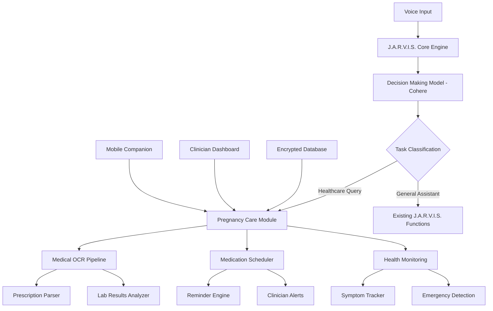
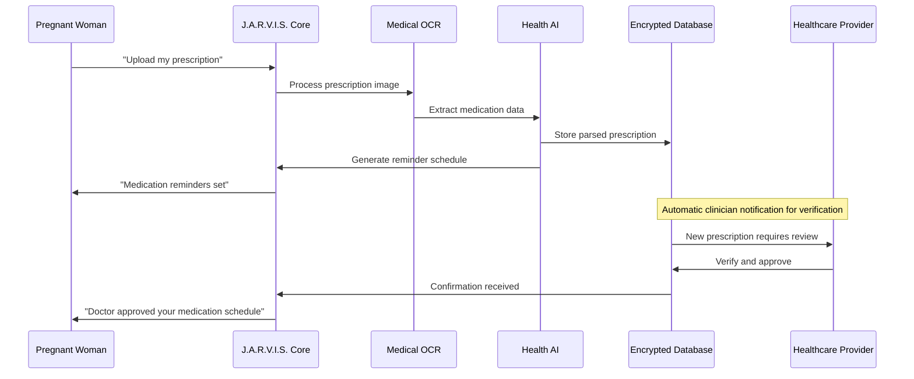

# J.A.R.V.I.S. Pregnancy Care Module - Premium AI Health Assistant

## Overview

Building upon the existing J.A.R.V.I.S. AI assistant infrastructure, this module transforms the system into a futuristic, premium pregnancy management platform. The expansion leverages the current voice-activated, multi-AI architecture while introducing specialized healthcare functionalities for expectant mothers.

### Core Value Proposition
- **Voice-First Healthcare**: Hands-free pregnancy care management using existing J.A.R.V.I.S. voice capabilities
- **Multi-AI Health Intelligence**: Prescription parsing, lab analysis, and personalized care recommendations
- **Seamless Integration**: Built on proven J.A.R.V.I.S. architecture with PyQt5 GUI and multi-threaded processing
- **Premium Experience**: Hospital-grade security with consumer-friendly interface

## Technology Stack & Dependencies

### Existing Infrastructure (Leveraged)
```
Core Framework: Python 3.10+ with PyQt5 GUI
AI Engine: Multi-AI architecture (Groq/Llama 3.3, Cohere, Google Gemini)
Voice Processing: Selenium-based Web Speech API + Text-to-Speech
Automation: PyAutoGUI, threading-based task execution
Real-time Data: Google Custom Search API integration
```

### New Healthcare Extensions
```
OCR Engine: Google ML Kit + Tesseract (prescription/lab parsing)
Medical NLP: OpenAI GPT-4 for healthcare-specific text processing
Scheduling: APScheduler + local database for medication reminders
Security: Cryptography library for HIPAA-compliant data encryption
Database: SQLite with encrypted storage + cloud sync capability
Mobile Companion: React Native app for cross-platform access
```

## Architecture

### High-Level System Design



### Core Module Integration

| Component | Current J.A.R.V.I.S. Integration | Healthcare Extension |
|-----------|-----------------------------------|---------------------|
| **Voice Interface** | Selenium Web Speech API | Medical terminology recognition |
| **AI Decision Making** | Cohere command-r-plus | Healthcare intent classification |
| **Response Generation** | Groq Llama 3.3 | Medical-safe response filtering |
| **Image Processing** | Google Gemini for generation | OCR for prescriptions/labs |
| **Automation** | System control via PyAutoGUI | Medication reminder scheduling |
| **GUI** | PyQt5 main interface | Healthcare dashboard overlay |

## Data Models & Database Schema

### Core Healthcare Entities

```sql
-- Patient Profile
CREATE TABLE patients (
    id INTEGER PRIMARY KEY,
    name TEXT ENCRYPTED,
    dob DATE ENCRYPTED,
    expected_due_date DATE,
    gestational_week INTEGER,
    allergies TEXT ENCRYPTED,
    emergency_contact TEXT ENCRYPTED,
    created_at TIMESTAMP DEFAULT CURRENT_TIMESTAMP
);

-- Prescription Management
CREATE TABLE prescriptions (
    id INTEGER PRIMARY KEY,
    patient_id INTEGER REFERENCES patients(id),
    image_path TEXT ENCRYPTED,
    ocr_text TEXT ENCRYPTED,
    parsed_medications JSON,
    verification_status TEXT DEFAULT 'pending',
    clinician_verified BOOLEAN DEFAULT FALSE,
    created_at TIMESTAMP DEFAULT CURRENT_TIMESTAMP
);

-- Medication Reminders
CREATE TABLE medication_reminders (
    id INTEGER PRIMARY KEY,
    patient_id INTEGER REFERENCES patients(id),
    prescription_id INTEGER REFERENCES prescriptions(id),
    medication_name TEXT,
    dosage TEXT,
    frequency TEXT,
    times JSON, -- ["08:00", "14:00", "20:00"]
    start_date DATE,
    end_date DATE,
    active BOOLEAN DEFAULT TRUE,
    snooze_count INTEGER DEFAULT 0,
    compliance_log JSON
);

-- Lab Results
CREATE TABLE lab_results (
    id INTEGER PRIMARY KEY,
    patient_id INTEGER REFERENCES patients(id),
    test_date DATE,
    test_type TEXT,
    results JSON,
    flagged_values JSON,
    urgency_level TEXT DEFAULT 'normal',
    clinician_notified BOOLEAN DEFAULT FALSE
);

-- Voice Commands Log (Healthcare)
CREATE TABLE healthcare_voice_commands (
    id INTEGER PRIMARY KEY,
    patient_id INTEGER,
    command_text TEXT,
    intent_classification TEXT,
    response_generated TEXT,
    timestamp TIMESTAMP DEFAULT CURRENT_TIMESTAMP
);
```

## Component Architecture

### 1. Healthcare Voice Command Processing

**Extension to existing Model.py decision-making:**

```python
# New healthcare functions added to existing funcs list
healthcare_funcs = [
    "medication reminder", "take medication", "log symptom", 
    "check lab results", "emergency alert", "prenatal appointment",
    "upload prescription", "medication schedule", "health summary"
]

# Enhanced preamble for healthcare commands
healthcare_preamble = """
...existing preamble...
-> Respond with 'medication reminder (medication details)' for medication-related queries
-> Respond with 'health emergency' for urgent medical concerns
-> Respond with 'prenatal care (query)' for pregnancy-specific questions
-> Respond with 'upload prescription' for prescription image processing
"""
```

### 2. Medical OCR & Prescription Parser

**New Backend/MedicalOCR.py module:**

```python
class PrescriptionParser:
    def __init__(self):
        self.ocr_engine = GoogleMLKit()  # Primary OCR
        self.nlp_client = OpenAI()       # Medical text processing
        
    def parse_prescription_image(self, image_path):
        # 1. Extract text using OCR
        raw_text = self.ocr_engine.extract_text(image_path)
        
        # 2. Parse medical information using NLP
        medical_prompt = f"""
        Extract medication information from this prescription:
        {raw_text}
        
        Return JSON with: medication_name, strength, frequency, duration, instructions
        """
        
        parsed_data = self.nlp_client.completion(medical_prompt)
        return self.validate_medical_data(parsed_data)
```

### 3. Medication Reminder Engine

**Integration with existing Main.py threading:**

```python
class PregnancyCareModule:
    def __init__(self):
        self.reminder_scheduler = APScheduler()
        self.voice_interface = existing_voice_system
        
    def schedule_medication_reminder(self, medication_data):
        # Create reminder jobs
        for time_slot in medication_data['times']:
            self.reminder_scheduler.add_job(
                func=self.trigger_voice_reminder,
                trigger='cron',
                hour=time_slot.split(':')[0],
                minute=time_slot.split(':')[1],
                args=[medication_data]
            )
    
    def trigger_voice_reminder(self, medication_data):
        # Use existing J.A.R.V.I.S. TTS system
        reminder_text = f"Time for your {medication_data['name']} medication"
        TextToSpeech(reminder_text)
        
        # Show GUI notification using existing system
        ShowTextToScreen(f"Medication Reminder: {medication_data['name']}")
```

### 4. Emergency Detection & Escalation

```python
class HealthEmergencyDetector:
    def analyze_lab_results(self, lab_data):
        emergency_indicators = {
            'hemoglobin': {'critical_low': 7.0, 'action': 'immediate_medical_attention'},
            'blood_pressure': {'critical_high': '160/110', 'action': 'preeclampsia_alert'},
            'protein_urine': {'critical_high': 300, 'action': 'kidney_function_alert'}
        }
        
        for test, value in lab_data.items():
            if self.is_critical_value(test, value, emergency_indicators):
                return self.trigger_emergency_protocol(test, value)
```

## Voice Interface Extensions

### Healthcare-Specific Commands

| Voice Command | J.A.R.V.I.S. Response | Action Triggered |
|---------------|------------------------|------------------|
| "Upload my prescription" | "I'll help you process your prescription. Please show it to the camera." | OCR pipeline activation |
| "Remind me to take iron tablets" | "Setting up iron tablet reminders. How many times per day?" | Medication scheduler |
| "Check my lab results" | "Reviewing your recent lab results..." | Lab analysis display |
| "I'm feeling contractions" | "I'm starting contraction timing. Speak 'contraction start' and 'contraction end'" | Emergency monitoring |
| "Call my doctor" | "Calling Dr. [Name] at [Number]" | Emergency contact |

### Enhanced GUI Integration

**Pregnancy Care Dashboard overlay on existing PyQt5 GUI:**

```python
# New healthcare panels added to existing GUI.py
class PregnancyDashboard(QWidget):
    def __init__(self):
        super().__init__()
        self.setup_healthcare_ui()
        
    def setup_healthcare_ui(self):
        layout = QVBoxLayout()
        
        # Gestational calendar widget
        self.pregnancy_calendar = PregnancyCalendarWidget()
        
        # Medication tracker
        self.medication_panel = MedicationTracker()
        
        # Quick health metrics
        self.health_metrics = HealthMetricsPanel()
        
        # Integration with existing J.A.R.V.I.S. status display
        self.jarvis_status = existing_status_widget
```

## Security & Compliance

### Healthcare Data Protection

```python
class HealthcareEncryption:
    def __init__(self):
        self.key = Fernet.generate_key()  # AES-256 encryption
        self.cipher = Fernet(self.key)
        
    def encrypt_medical_data(self, sensitive_data):
        return self.cipher.encrypt(sensitive_data.encode())
        
    def decrypt_medical_data(self, encrypted_data):
        return self.cipher.decrypt(encrypted_data).decode()

# Audit logging for all healthcare interactions
class HealthcareAuditLogger:
    def log_medical_interaction(self, action, patient_id, details):
        audit_entry = {
            'timestamp': datetime.now(),
            'action': action,
            'patient_id': patient_id,
            'details': details,
            'system_user': 'JARVIS_SYSTEM'
        }
        self.encrypted_storage.store_audit_log(audit_entry)
```

## Testing Strategy

### Healthcare-Specific Testing

```python
# Unit Tests for Medical Processing
class TestPrescriptionParser(unittest.TestCase):
    def test_medication_extraction_accuracy(self):
        sample_prescriptions = load_test_prescriptions()
        for prescription in sample_prescriptions:
            result = parser.parse_prescription(prescription)
            self.assert_medication_accuracy(result)
            
    def test_emergency_detection(self):
        critical_lab_values = load_critical_test_cases()
        for lab_result in critical_lab_values:
            emergency_status = detector.analyze_emergency(lab_result)
            self.assertTrue(emergency_status.requires_immediate_attention)

# Integration Tests with J.A.R.V.I.S. Core
class TestVoiceHealthcareIntegration(unittest.TestCase):
    def test_healthcare_voice_commands(self):
        health_commands = [
            "remind me to take my vitamins",
            "upload my prescription",
            "check my blood test results"
        ]
        
        for command in health_commands:
            response = MainExecution(command)
            self.assertIn("healthcare", response.classification)
```

## Clinician Dashboard (Web Interface)

### Staff Monitoring System

```python
# Web dashboard using Flask (new addition to project)
from flask import Flask, render_template, request
from flask_login import login_required

class ClinicianDashboard:
    def __init__(self):
        self.app = Flask(__name__)
        self.setup_routes()
        
    @app.route('/patients')
    @login_required
    def patient_list():
        patients = get_active_patients()
        return render_template('patient_dashboard.html', patients=patients)
        
    @app.route('/verify_prescription/<prescription_id>')
    @login_required
    def verify_prescription(prescription_id):
        # Allow clinicians to verify AI-parsed prescriptions
        prescription = get_prescription(prescription_id)
        return render_template('prescription_verification.html', prescription=prescription)
```

## Mobile Companion App

### React Native Integration

```javascript
// Mobile app architecture
class JarvisPregnancyApp extends Component {
  constructor(props) {
    super(props);
    this.jarvisConnection = new WebSocketConnection();
  }
  
  // Voice command relay to main J.A.R.V.I.S. system
  sendVoiceCommand = (command) => {
    this.jarvisConnection.send({
      type: 'VOICE_COMMAND',
      command: command,
      timestamp: Date.now()
    });
  }
  
  // Medication reminder notifications
  setupPushNotifications = () => {
    PushNotification.configure({
      onNotification: function(notification) {
        if (notification.category === 'MEDICATION_REMINDER') {
          this.handleMedicationReminder(notification);
        }
      }
    });
  }
}
```

## Premium Features Implementation

### AI Health Coach

```python
class AIHealthCoach:
    def __init__(self):
        self.llm_client = existing_groq_client  # Reuse J.A.R.V.I.S. AI
        
    def generate_personalized_advice(self, patient_data):
        health_prompt = f"""
        Based on this pregnancy profile:
        - Gestational week: {patient_data.gestational_week}
        - Recent symptoms: {patient_data.recent_symptoms}
        - Lab results: {patient_data.latest_labs}
        
        Provide personalized health advice following medical guidelines.
        """
        
        return self.llm_client.chat.completions.create(
            model="llama-3.3-70b-versatile",
            messages=[{"role": "system", "content": health_prompt}]
        )
```

### Wearable Device Integration

```python
class WearableIntegration:
    def connect_fitness_tracker(self):
        # Integration with popular fitness trackers
        supported_devices = ['fitbit', 'apple_watch', 'garmin']
        
    def sync_health_metrics(self):
        # Automatically sync step count, heart rate, sleep data
        metrics = self.device.get_daily_metrics()
        return self.correlate_with_pregnancy_data(metrics)
```

## Data Flow Architecture

### Pregnancy Care Information Flow



## Implementation Roadmap

### Phase 1: Core Healthcare Integration (4-6 weeks)
- Extend existing J.A.R.V.I.S. decision model with healthcare commands
- Implement basic medication reminder system using existing threading
- Add encrypted healthcare database with SQLite
- Create pregnancy care GUI overlay on existing PyQt5 interface

### Phase 2: Advanced Medical Processing (6-8 weeks)
- Integrate Google ML Kit OCR for prescription processing
- Implement OpenAI-based medical text parsing
- Add emergency detection and escalation protocols
- Create clinician dashboard web interface

### Phase 3: Mobile & Premium Features (8-10 weeks)
- Develop React Native companion app
- Implement wearable device integrations
- Add AI health coaching capabilities
- Deploy secure cloud synchronization

### Phase 4: Testing & Compliance (4-6 weeks)
- Comprehensive healthcare testing suite
- Security audit and HIPAA compliance review
- User acceptance testing with pregnant women
- Clinician training and onboarding

## Business Model & Monetization

### Revenue Streams
1. **Freemium Model**: Basic medication reminders free, premium features subscription
2. **Healthcare Partnerships**: Revenue sharing with maternity clinics and hospitals
3. **Clinician Licensing**: Monthly fees for healthcare provider dashboard access
4. **Premium AI Coach**: Advanced personalized health guidance subscription

### Go-to-Market Strategy
- Partner with existing OB/GYN practices for beta testing
- Integration with hospital systems through clinician dashboard
- Consumer marketing through pregnancy and parenting communities
- Insurance partnership for coverage of premium features

## Risk Mitigation & Legal Compliance

### Medical Liability Protection
- **AI Disclaimer Framework**: All AI-generated recommendations include clear disclaimers
- **Clinician Verification Gates**: Critical medical decisions require healthcare provider approval
- **Emergency Escalation**: Automatic routing of urgent conditions to medical professionals
- **Audit Trail Maintenance**: Complete logging of all medical interactions for legal protection

### Data Privacy & Security
- **End-to-End Encryption**: AES-256 encryption for all healthcare data at rest and in transit
- **HIPAA Compliance**: Full adherence to healthcare privacy regulations
- **User Consent Management**: Granular permissions for data sharing and processing
- **Right to Deletion**: Complete data removal capabilities per user request

### Technical Risk Management
- **Offline Functionality**: Critical medication reminders work without internet connectivity
- **Backup Systems**: Multiple fallback mechanisms for voice recognition and notifications
- **Data Redundancy**: Encrypted backups with geographic distribution
- **System Monitoring**: 24/7 health monitoring of all critical healthcare functions